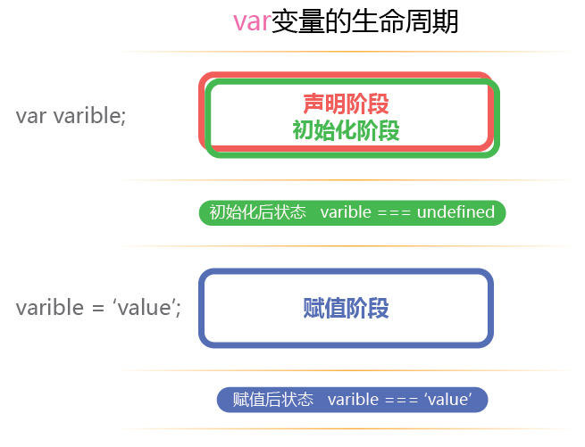
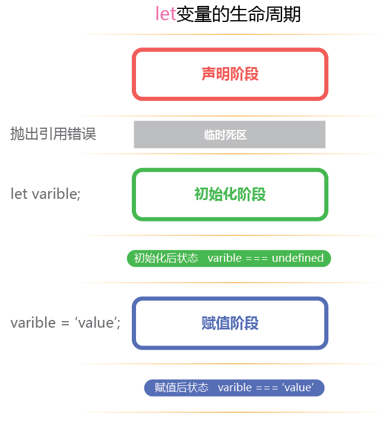
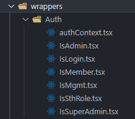
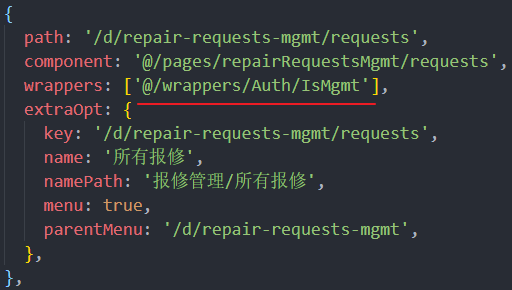

## QA

---

### JavaScript 和 C 的区别

1. JavaScript 是弱类型语言，C 是强类型语言
2. JavaScript 面向对象，C 面向过程
3. JavaScript 一般运行在浏览器或 v8 引擎中，JavaScript 是解释型语言

<!--truncate-->

 <br/>

### 面向对象三大特点

多态性、继承性、封装性。

 <br/>

### 什么是多态，举个例子

子类继承父类后，可以使用子类来实例化一个父类对象，可以调用在子类复写（实现）的父类上的（抽象）方法，同时该父类对象能够向下转型成子类对象。

 ```java
 class Parent {
   public void do() {
     System.out.println("parent do sth");
   }
 }
 
 class Child extends Parent {
   public void do() {
     System.out.println("child do sth");
   }
 }
 
 Parent p = new Child();
 p.do();
 // => 'child do sth'
 ```

 <br/>

### 什么是继承

子类继承父类的特征和行为，使得子类对象（实例）具有父类的属性和方法。

 <br/>

### JavaScript 闭包是什么

当函数可以记住并访问当前所在的词法作用域时，就形成了闭包。  
通俗点说，当函数引用了一个函数外部的变量时，就形成了一个闭包，这个闭包包括该函数本身的词法作用域，和引用变量的词法作用域。

```javascript
function fn1() {
  var a = 'a'
  return function() {
    console.log(a)
  }
}

var fn2 = fn1()
// fn2 引用了 fn1 词法环境中的 a 变量，形成闭包。
```

> 参考：
>
> [[译] 理解 JavaScript 中的执行上下文和执行栈](https://juejin.cn/post/6844903682283143181)
>
> [闭包详解一](https://juejin.cn/post/6844903612879994887)

 <br/>

### 什么场景下用得上闭包

定义模块

```javascript
function module() {
  var arr = [];
  function add(val) {
    arr.push(val)
  }
  function get(index) {
    index < arr.length ? arr[index] : null
  }
  return {
    add,
    get
  }
}

var m = module()
```

某些场景下的异步回调函数

```javascript
function fn(callBack) {
  for (var a = 1; a <= 5; a++) {
    (function() {
    	var val = a
    	setTimeout(function() {
    		callBack(val)
  		}, 1000)
  	})()
  }
}

function callBack(val) {
  console.log(val)
}

fn(callBack)
=> 
1
2
3
4
5
```

 <br/>

### HTML5 新特性

* 语义化标签 aside、header、footer、section 等等
* video、audio 媒体标签
* WebWorker、WebStorage、WebSocket、Canvas绘图、SVG绘图、拽托、地理位置信息等一系列新 Api
* 更强大的表单
  * Input 拥有了更多的输入类型如：color、date、email、number、range、url、tel 等等
  * datalist：配合 Input 的 list 属性，规定输入域的选项列表
  * keygen：用于进行表单内容的非对称加密
  * output：用于显示表单经过计算的结果，原生 submit 不会被提交
  * 新的属性：placeholder、required 等等

 <br/>

### 能通过什么编码手段实现标签语义化

定义一套命名规范，运用在 class、id 中以实现语义化。

 <br/>

### ES6 新特性

* 新的变量类型：let、const
* 局部作用域（词法环境、变量环境）
* Object、字符串、array 等等类型的方法拓展
* Set、Map 数据结构
* Proxy 代理对象、Reflect 对象、Promise 对象
* async、await 语法
* Class 语法
* Module 语法
* 异步遍历器

 <br/>

### let、var、const 之间的区别

* let、const
  * 块级作用域
  * 不存在变量提升
  * 暂时性死区
  * 不能重复声明
  * const 声明后必须立即赋值，否则报错
  * const 基础类型不能修改，引用类型可以修改内部的数据（对象、数组等）

 <br/>

### 为什么 var 变量能在声明前使用

变量的生命周期可以抽象为：声明阶段 => 初始化阶段 => 赋值阶段 。

变量会在代码执行前完成 **声明阶段**，var 变量的初始化阶段会在声明阶段后立即执行，故我们能拿到 `undefined` 。



let、const 声明阶段过后不会立即初始化，所以其引用为空，提前使用会报引用错误 。



 <br/>

### 什么是变量提升

在任意作用域下，在声明一个 var 变量前能够使用该变量，值为 `undefined` 。

```javascript
console.log(a)
=> undefined
var a = 'a'
```

 <br/>

### let 如何实现局部作用域

let 不会变量提升，且只存在于当前块的词法环境中，外层无法访问。  
被当前块包裹的子块可以通过子块自身词法环境中的 `outer` （指向外层词法环境），来访问当前块词法环境中的变量。

```javascript
{
  let val = 'val'
  {
    console.log(val)
    => 'val'
  }
}
console.log(val)
=> 引用错误：未声明变量
```

 <br/>

### JavaScript 基础变量类型有哪些

* 基本类型
  * string
  * boolean
  * number
  * null
  * undefined
  * symbol（es6加入）
* 引用类型（复杂类型/对象类型）
  * Object（array、function 等都是对象的子类）

 <br/>

### 引用变量和基础变量的区别

基础变量在内存中记录的是其变量的值。  
引用变量记录的是一个内存地址，该地址指向的内存存储着其值。

 <br/>

### 变量如何存在内存中

**基础变量的值** 、**引用变量的指针**存在 `Stack`（栈）中。

**引用变量的指针**指向 `Heap`（堆） 中对应的值。  

  <br/>

### 原型链了解过吗

每个对象都有一个**隐式原型** `__proto__`，它指向该对象构造函数的**显示原型** `prototype`。

当访问某对象的属性时，先在对象实例本身查找；  
若没有则会去 `__proto__` （即构造函数的 `prototype` ）上查找；  
如果还是没有，就会去构造函数的 `__proto__`（即构造函数 `prototype` 上的 `__proto__`）上找；

最后会到顶端的 `Object.prototype` 中查找属性，若还是没有，则会返回 `Object.prototype.__proto__`，值为 `null`。  

 <br/>

### 实现一个绝对居中布局

* flex 布局

  ```html
  <!DOCTYPE html>
  <html lang="en">
    <head>
      <meta charset="UTF-8" />
      <meta http-equiv="X-UA-Compatible" content="IE=edge" />
      <meta name="viewport" content="width=device-width, initial-scale=1.0" />
      <title>Document</title>
      <style>
        * {
          padding: 0;
          margin: 0;
        }
        .app {
          height: 100vh;
          display: flex;
          justify-content: center;
          align-items: center;
        }
        .block {
          width: 100px;
          height: 100px;
          background-color: brown;
        }
      </style>
    </head>
    <body>
      <div class="app">
        <div class="block"></div>
      </div>
    </body>
    <script></script>
  </html>
  ```

* absolute 定位

  ```html
  <!DOCTYPE html>
  <html lang="en">
    <head>
      <meta charset="UTF-8" />
      <meta http-equiv="X-UA-Compatible" content="IE=edge" />
      <meta name="viewport" content="width=device-width, initial-scale=1.0" />
      <title>Document</title>
      <style>
        * {
          padding: 0;
          margin: 0;
        }
        .app {
          height: 100vh;
          width: 100%;
          position: relative;
        }
        .block {
          width: 100px;
          height: 100px;
          background-color: brown;
          position: absolute;
          left: 50%;
          top: 50%;
          transform: translate(-50%, -50%);
        }
      </style>
    </head>
    <body>
      <div class="app">
        <div class="block"></div>
      </div>
    </body>
    <script></script>
  </html>
  ```

* table-cell

  ```html
  <!DOCTYPE html>
  <html lang="en">
    <head>
      <meta charset="UTF-8" />
      <meta http-equiv="X-UA-Compatible" content="IE=edge" />
      <meta name="viewport" content="width=device-width, initial-scale=1.0" />
      <title>Document</title>
      <style>
        * {
          padding: 0;
          margin: 0;
        }
        .app {
          height: 100vh;
          width: 100vw;
          display: table-cell;
          text-align: center;
          vertical-align: middle;
          font-size: 0;
        }
        .block {
          width: 100px;
          height: 100px;
          background-color: brown;
          display: inline-block;
        }
      </style>
    </head>
    <body>
      <div class="app">
        <div class="block"></div>
      </div>
    </body>
    <script></script>
  </html>
  ```

 <br/>

### jq 和 Vue 的区别

* jq 直接操作dom；vue 更多的是操作数据
* jq 是事件驱动型；vue 是数据驱动型
* jq 适合简单的、逻辑复杂度低的单页面开发；vue 适合逻辑复杂的大型项目
* jq 是最传统的三件套开发模式；vue 有特有的 .vue 文件

 <br/>

### 什么是数据驱动型

根据数据的变化进行操作。

 <br/>

### Vue 的生命周期钩子函数有那些

* beforeCreate
* created
* beforeMount
* mounted
* beforeDestroy
* destroyed

 <br/>

### 哪个生命周期能操作 Dom

mounted

 <br/>

### 如何实现在 Created 中操作 Dom

`document.getElementByxxxx` 即可获取 dom 节点并进行操作。

 <br/>

### Vue 的特点

Vue 是 MVVM 框架，其中 ViewModel 的双向数据绑定是其核心特点。

 <br/>

### 双向绑定原理

Vue 使用 `Object.defineProperty` 劫持了数据；  
在 `set` 时（即修改数据时）会操作 `Dep`（订阅者容器）通知其中的 `Watcher`（订阅者）更新订阅了数据的视图；  
Vue 在初始化的时候会使用 `Compile` 解析模板中的指令，使用 `Watcher` 订阅对应数据，同时初始化视图。

在 `input` 标签里使用 `v-model` 时，Vue 会监听其 `input` 事件，当输入内容时，触发事件并修改对应的数据（即触发了 `set`）。


 <br/>

### v-if 和 v-show 的区别

* `v-if` 为 `false` 时节点不会出现在 Dom 树中
* `v-show` 为 `false` 时节点会添加上 `display: none` 内联样式

 <br/>

### v-if 和 v-for 能否一起使用，编译是否会报错

可以一起使用；  
Vue2 中会把 `v-for` 循环中的每个节点单独加上 `v-if`，性能损耗大，编译器不会报错，会警告；  
Vue3 中调整了指令的优先级，会先判断 `v-if` 决定是否渲染整个列表。

 <br/>

### React 和 Vue 的区别

* React 比 Vue 更灵活，React 只根据组件状态做了较基础的 diff 算法优化渲染速度（即使只是这样也很快了），许多性能优化的点需要开发者自己把控
* Vue 封装的更加彻底，例如计算属性 `computed` 缓存能力，在 React 中需要自己写缓存函数来实现

 <br/>

### zscnsd 项目中如何鉴权

封装了一个鉴权的容器组件，把需要鉴权渲染的组件包裹其中，该容器会根据全局上下文中的用户权限决定是否渲染该组件。



在路由中也通过配置这些容器来实现路由鉴权。



 <br/>

### 如何实现按钮级鉴权

如上题所述

> 封装了一个鉴权的容器组件，把需要鉴权渲染的组件包裹其中，该容器会根据全局上下文中的用户权限决定是否渲染该组件。

 <br/>

### 网络哪几层

7层，分别是：

* 物理层
* 数据链路层
* 网络层
* 传输层
* 会话层
* 表示层
* 应用层

 <br/>

### http 请求过程

1. TCP 连接，三次握手
2. 发送数据，服务器响应
3. 关闭连接，四次挥手（如果请求或响应头中有 `connection: keep-alive` 则不关闭连接

 <br/>

### 断开 http 连接的过程

四次挥手

1. Client 告知 Server 自己要关闭连接
2. Server 告知 Client 已收到你要关闭连接的信息
3. Server 告知 Client 自己要关闭连接
4. Client 收到后等待一段时间，接着告知 Server 已收到你要关闭连接的信息

 <br/>

### 基础数据结构有哪些

* 数组
* 链表
* 堆
* 栈
* 树
* 队列

 <br/>

### 数组的数据结构

#### 一般来说

数组是**线性结构**，一个数组在内存中的**地址连续**，且存储的**数据类型固定**，所以能够轻松的通过 `下标 * dataSize` 来计算对应元素的存储地址，因此**随机访问性能很好**。

但数组的长度也是固定的，若需要在某位置插入元素，需要把后面的元素全部向后移动一位，因此**插入性能一般**。

#### 在 JS 中

Js 中的数组可以**存储任意类型数据**，是假数组，在内存中**地址不连续**，是哈希映射，有多种实现，其中一种就是链表，其访问时间复杂度最坏情况是 `O(n)`，**查找性能一般**。

后来其实现做出了改进，若数组中**连续的一段下标的数据类型相同**，那么他们会**分配到连续的内存中**，查找性能会好很多。因此在 Js 中数据量较大且有查找需求的时候，尽量遵循这种规范使用数组，性能表现会好很多。

 <br/>

### 数组和链表的区别

* 数组在内存中是连续的，链表是不连续的
* 数组随机访问性能强
* 链表插入性能强

 <br/>

### 两者查找谁快

数组

 <br/>

### 动态数组的实现

动态数组就是可以扩容、且删除数据后该数据后的下标会改变的数组。

* 插入（假设插入在 `n` 且 `0 <= n < length`）：

  1. 在插入时若数组已满
  2. 申请 `(length + 1) * dataSize` 长度的新的内存
  3. 把 `n` 之前的一一对应挪到新内存
  4. 将 `n` 到 `length - 1` 的元素全部移到新内存中 `旧下标 + 1`  的位置
  5. 将插入的数据放到新内存的 `n` 上

  > 若数组空间足够，则在当前内存中进行 4,5，其中 4 需要倒序向后挪动。
  
* 删除（假设删除 `n` 且 `0 <= n < length`）：

  1. 删除 `n` 上的元素
  2. 将 `n` 到 `length - 1` 的元素移到 `旧下标 - 1` 的位置，正序向前移动

* 新增：

  * 同插入，插入下标为 `length - 1`

* 修改：

  * 同普通数组

 <br/>

### 都是整数的一维数组，找出任意两数和等于该数组中任意数，标出两数下标（数组不会有重复的值）

```javascript
const arr = [6, 5, 4, 3, 2, 1];

// 冒泡 O(n^3)
const bubble = (arr = []) => {
  if (arr.length === 0) {
    return;
  }
  console.time('bubble');
  for (let i = arr.length - 1; i >= 0; i--) {
    for (let j = i - 1; j >= 0; j--) {
      for (let z = arr.length - 1; z >= 0; z--) {
        if (z !== i && z !== j && arr[z] === arr[i] + arr[j])
          console.log(`${j} ${i}`);
      }
    }
  }
  console.timeEnd('bubble');
};

bubble(arr);

=>
4 5
3 5
2 5
1 5
3 4
2 4
bubble: 5.549ms
```

 <br/>

### 除了冒泡还有更快的方法吗

加入双指针优化速度

```javascript
const arr = [6, 5, 4, 3, 2, 1];

// 排序双指针
const doublePointer = (arr = []) => {
  if (arr.length === 0) {
    return;
  }
  // 先从小到大排序
  console.time('doublePointer');
  // 用于记录 value: index 关系
  const arrMap = new Map();
  arr.forEach((value, index) => {
    !arrMap.has(value) && arrMap.set(value, index);
  });
  let _arr = (
    arr.length > 10 ? utils.Array.quickSort(arr) : utils.Array.insertSort(arr)
  ).concat();
  // 遍历 len - 1 到 2
  for (let k = _arr.length - 1; k >= 2; k--) {
    // 两指针分别指向除 k 外的头尾
    let i = 0;
    let j = _arr.length - 1;
    // 相遇前两指针一直走向对方
    while (i < j) {
      let sum = _arr[i] + _arr[j];
      /**
       * 不拿 k 本身的值来计算;
       * 若和小于 k 的值，则和需要更大，左侧指针走一步 ++i;
       * 若和大于 k 的值，则和需要更小，右侧指针走一步 --j;
       * 若相等，则打印下标，两指针各走一步, ++i --j
       */
      if (k === j) {
        --j;
      } else if (sum < _arr[k]) {
        ++i;
      } else if (sum > _arr[k]) {
        --j;
      } else {
        console.log(`${arrMap.get(_arr[i])} ${arrMap.get(_arr[j])}`);
        ++i;
        --j;
      }
    }
  }
  console.timeEnd('doublePointer');
};

doublePointer(arr);

=>
5 1
4 2
5 2
4 3
5 3
5 4
doublePointer: 0.909ms
```

> 参考了 LeetCode 上的 [三数之和](https://leetcode-cn.com/problems/3sum/) 的这个 [解答](https://leetcode-cn.com/problems/3sum/solution/3sumpai-xu-shuang-zhi-zhen-yi-dong-by-jyd/)
>
> "犹豫不决先排序，步步逼近双指针"
>
> 学到了学到了

