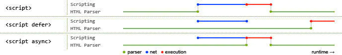
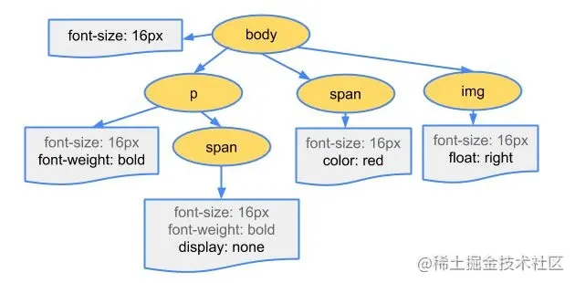
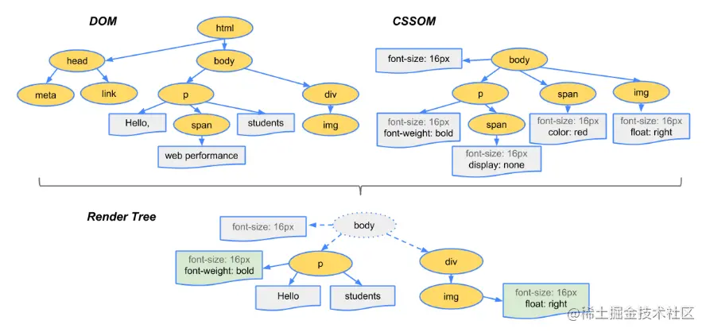

> 本文参考了：[浏览器渲染过程与性能优化](https://juejin.cn/post/6844903501953237006)

根据链接发送 http 请求 `HTML` 并解析，大致步骤如下：

- 处理 `HTML` 标记数据并生成 `DOM` 树

- 处理 `CSS` 标记数据并生成 `CSSOM` 树

- 将 `DOM` 树与 `CSSOM` 树合并在一起生成渲染树

- 遍历渲染树开始布局，计算每个节点的位置信息

- 将每个节点绘制到屏幕

## 生成 DOM 树

- 编码：将 `HTML` 字节数据根据响应头数据转换为其指定编码的字符

- 令牌化：浏览器**会根据 `HTML` 规范来将字符串转换成各种令牌**（如 `<html>`,`<body>` 这样的标签以及标签中的字符串和属性等都会被转化为令牌，每个令牌具有特殊含义和一组规则）

  令牌记录了标签的开始与结束，通过这个特性可以轻松判断一个标签是否为子标签（假设有 `<html>` 与 `<body>` 两个标签，当 `<html>` 标签的令牌还未遇到它的结束令牌 `</html>` 就遇见了 `<body>` 标签令牌，那么 `<body>` 就是 `<html>` 的子标签）

- 生成对象：接下来每个令牌都会被转换成定义其属性和规则的对象（就是节点对象）

- 构建完毕： `DOM` 树构建完成，整个对象集合就像是一棵树形结构

  可能有人会疑惑为什么 `DOM` 是一个树形结构，这是因为标签之间含有复杂的父子关系，树形结构正好可以诠释这个关系（`CSSOM` 同理，层叠样式也含有父子关系。例如：`div p {font-size: 18px}`，会先寻找所有 p 标签并判断它的父标签是否为 div 之后才会决定要不要采用这个样式进行渲染）

简单来说 `DOM` 树构建过程：**字节 > 字符 > 令牌 > 节点对象 > 对象模型(OM)**


### script 标签

遇到最基本的 `script` 标签时，会阻塞浏览器并请求 js 文件（内联无需请求），请求后会立即执行 js，执行完毕后浏览器才继续解析

阻塞浏览器其实很不好，用户会觉得卡，我们可以给 `script` 加上特别的属性来实现异步请求和渲染结束后执行

- async

  ```html
  <script type="text/javascript" src="index.js" async></script>
  ```

  这样申明的 `script` 在请求时是异步的，不会阻塞浏览器

  请求完毕后会立刻执行，如果此时浏览器还未渲染完成，会阻塞；并且对未解析生成的节点操作无效

- defer

  ```html
  <script type="text/javascript" src="index.js" defer></script>
  ```

  也会异步加载；特点是加载后不会立即执行脚本，等待文档所有元素解析完后，脚本会在 `DOMContentLoaded` 事件触发之前执行



## 生成 CSSOM 树

解析 `HTML` 遇到 `<link>` 标签时，浏览器会去根据标签属性请求对应资源，当请求到的是 `CSS` 文件时，会开始 `CSS` 解析，阻塞浏览器渲染

对于内联的样式，无需发送请求

**`CSSOM` 生成过程与 `DOM` 没有什么差别**

假设请求到的文件内容如下：

```css
body {
  font-size: 16px;
}
p {
  font-weight: bold;
}
span {
  color: red;
}
p span {
  display: none;
}
img {
  float: right;
}
```

解析出来的 `CSSOM` 树大致如下：



## 生成渲染树

**渲染树就是 `DOM` 树与 `CSSOM` 树结合后的产物**



- 浏览器会先从 `DOM` 树的根节点开始遍历每个可见节点

  - 不可见的节点包括 `display: none` 属性的节点

  - `visibility: hidden` 不算是不可见，它的语义是隐藏元素，但元素仍然占据着布局空间，所以它会被渲染成一个空框

- 对每个可见节点，找到其适配的 `CSS` 样式规则并应用

- 渲染树构建完成，每个节点都是可见节点并且都含有其内容和对应规则的样式

## 布局阶段

该步骤主要工作是**计算每个节点在窗口内的确切位置与大小**

从渲染树的根节点开始遍历，然后确定每个节点对象在页面上的**确切大小与位置**

其输出是一个盒子模型，它会精确地捕获每个元素在屏幕内的确切位置与大小，所有相对的测量值也都会被转换为**屏幕内的绝对像素值**

## 渲染

布局(`Layout`) 完成后，浏览器会发出 `Paint Setup`,`Paint` 事件，开始将渲染树绘制成像素，绘制耗时跟 `CSS` 样式复杂度成正比
