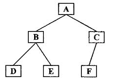

## 前序遍历

> 遍历顺序：**根左右**（`DFS 深度优先遍历`）

先访问根节点，然后遍历左子树，最后遍历右子树



结果：`ABDECF`

### 递归实现

```javascript
var preorderTraversal = function (root, array = []) {
  if (root) {
    array.push(root.val);
    preorderTraversal(root.left, array);
    preorderTraversal(root.right, array);
  }
  return array;
};
```

### 非递归实现

从根节点开始遍历：

1. 访问节点值

2. 左孩子入栈，直到节点左孩子为空

3. 节点出栈，以节点的右孩子为目标重复 `1`,`2`,`3`

```javascript
var preorderTraversal = function (root) {
  const result = [];
  const stack = [];
  let current = root;
  while (current || stack.length > 0) {
    // 从当前节点开始，边访问值边把左孩子依次入栈
    while (current) {
      result.push(current.val);
      stack.push(current);
      current = current.left;
    }
    // 当前节点（上一个节点的左孩子）为空，取出上一个节点
    current = stack.pop();
    // 从节点的右子树开始重复之前的操作
    current = current.right;
  }
  return result;
};
```

## 中序遍历

> 遍历顺序：**左根右**

先遍历左子树，然后访问根节点，最后遍历右子树


结果：`DBEAFC`

### 递归实现

```javascript
var inorderTraversal = function (root, array = []) {
  if (root) {
    inorderTraversal(root.left, array);
    array.push(root.val);
    inorderTraversal(root.right, array);
  }
  return array;
};
```

### 非递归实现

从根节点开始遍历：

1. 左孩子入栈，直到节点左孩子为空

2. 出栈并访问节点值

3. 以节点的右孩子为目标重复 `1`,`2`,`3`

```javascript
var inorderTraversal = function (root) {
  const result = [];
  const stack = [];
  let current = root;
  while (current || stack.length > 0) {
    // 从当前节点开始，把所有左孩子入栈
    while (current) {
      stack.push(current);
      current = current.left;
    }
    // 当前节点（上一个节点的左孩子）为空，上一个节点出栈
    current = stack.pop();
    // 访问节点值
    result.push(current.val);
    // 从节点的右子树开始重复之前的操作
    current = current.right;
  }
  return result;
};
```

## 后序遍历

> 遍历顺序：**左右根**

先遍历左子树，然后遍历右子树，最后访问根节点


结果：`DEBFCA`

### 递归实现

```javascript
var postorderTraversal = function (root, array = []) {
  if (root) {
    postorderTraversal(root.left, array);
    postorderTraversal(root.right, array);
    array.push(root.val);
  }
  return array;
};
```

### 非递归实现

从根节点开始遍历：

1. 左孩子入栈，直到节点左孩子为空

2. 检查栈顶的节点，如果右节点为空或者右节点被访问过，节点出栈并访问，并标记节点为已访问

3. 如果栈顶的右节点不为空且未访问，以节点的右孩子为目标重复 `1`,`2`,`3`

```javascript
var postorderTraversal = function (root) {
  const result = [];
  const stack = [];
  let last = null; // 标记上一个访问的节点
  let current = root;
  while (current || stack.length > 0) {
    // 从当前节点开始，把所有左孩子入栈
    while (current) {
      stack.push(current);
      current = current.left;
    }
    // 获得栈顶节点
    current = stack[stack.length - 1];
    // 如果栈顶节点没有右节点 或 右节点已访问过
    if (!current.right || current.right == last) {
      // 节点出栈并访问值
      current = stack.pop();
      result.push(current.val);
      // 标记节点为已访问
      last = current;
      current = null; // 继续去到下一个栈顶节点
    } else {
      // 有右节点且没有被访问过，从右子树开始重复之前的操作
      current = current.right;
    }
  }
  return result;
};
```
