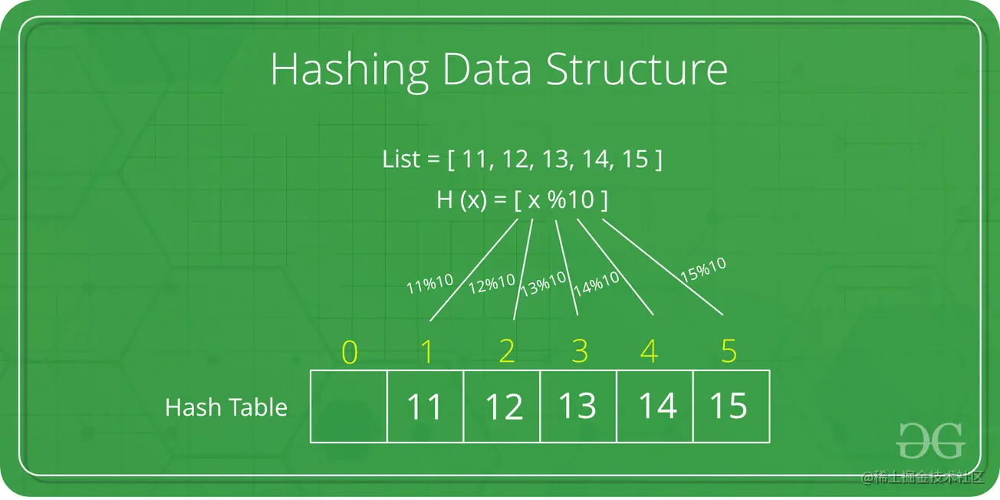

## 简述

哈希的基本原理是将给定的键值转换为偏移地址来检索记录

键转换为地址是通过一种关系（公式）来完成的，这就是哈希（散列）函数

## 缺点

虽然哈希表是一种有效的搜索技术，但是它还有些缺点

两个不同的关键字，由于哈希函数值相同，因而被映射到同一表位置上。该现象称为冲突

发生冲突的两个关键字称为该哈希函数的**同义词**

如何设计哈希函数以及如何避免冲突就是哈希表的常见问题，好的哈希函数的选择有两条标准：

1. 简单并且能够快速计算

2. 能够在址空间中获取键的均匀分布

## 应用

应用到哈希表的经典题目：[两数之和](https://leetcode.cn/problems/two-sum/)
