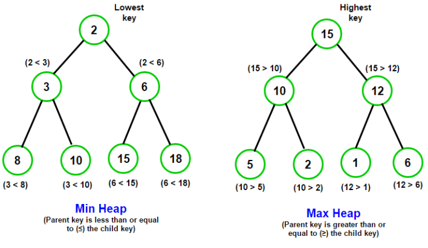

## 简述

- 堆属于**优先队列**，先进先出

- 堆是一颗**完全二叉树**

- 任意节点值是其子树所有节点的最大值或最小值

## 完全二叉树

定义：一棵深度为 `k` 的有 `n` 个结点的二叉树，对树中的结点按从上至下、从左到右的顺序进行编号，如果编号为 `i` $(0≤i<n)$ 的结点与满二叉树中编号为 `i` 的结点在二叉树中的位置相同，那么它就是完全二叉树

简单来说：减去最后一层是**满二叉树**、并且最后一层中**第一个节点和最后一个节点之间没有空节点**的树，就是完全二叉树

### 公式

索引从 `0` 开始计算

- 节点数为 `n`，**最后一个**非叶子节点索引号：$floor(\frac{n}{2}-1)$

- 节点索引号为 `i` 的孩子节点索引号：$2i+1$, $2i+2$

- 除根节点外，节点索引号为 `i` 的父节点索引号为 $floor(\frac{i-1}{2})$

- 节点数为 `n`，树高度 `k` 为 $\log_{2}{n}$

## 最大堆

又称**大顶堆**

任意一个子树的最大值都在该树的根节点

从堆顶到底部的节点从大到小

## 最小堆

又称**小顶堆**

任意一个子树的最小值都在该树的根节点

从堆顶到底部的节点从小到大

