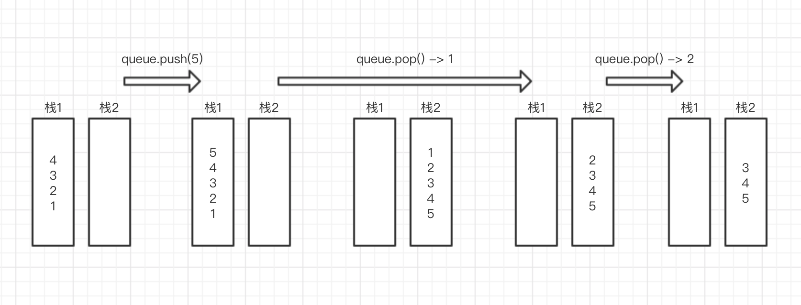

## 思路

队列和栈的区别就是**弹出顺序**，我们只需要把**反转出栈顺序**即可

那么需要维护两个栈，一个栈用来入列，一个栈来反转元素顺序并出列：

- **入列栈**（栈1）

  推入队列的数据都丢到这

- **出列栈**（栈2）

  弹出时从这个栈弹出，如果没有数据，则把入列栈的所有数据弹出并压入，然后再弹出以反转顺序



## 实现

```javascript
function queue() {
  this.pushStack = [];
  this.popStack = [];
}
queue.prototype = {
  push: function (item) {
    this.pushStack.push(item);
  },
  pop: function () {
    if (this.popStack.length === 0) {
      while (this.pushStack.length) {
        this.popStack.push(this.pushStack.pop());
      }
    }
    return this.popStack.pop();
  },
  show: function () {
    console.log(this.pushStack.concat(this.popStack.reverse()));
  },
};

const q = new queue();
q.push(1); // [1]
q.push(2); // [1, 2]
q.push(3); // [1, 2, 3]
q.pop(); // 1 -> [2, 3]
```
