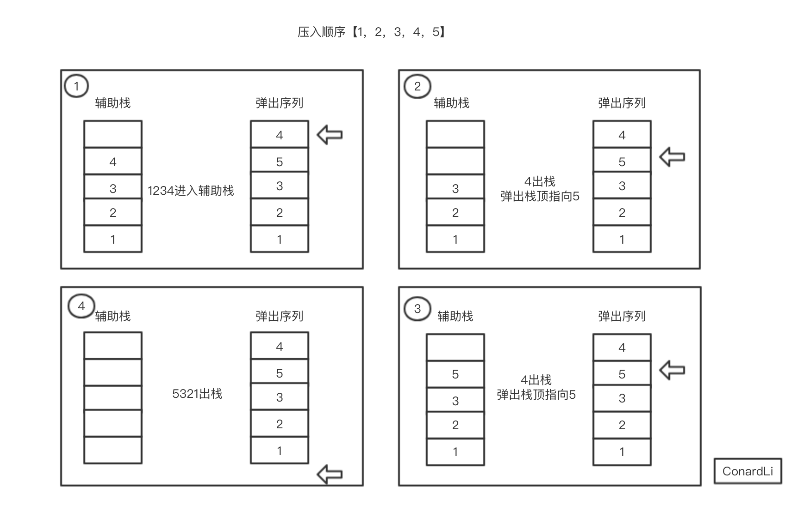

## 问题

输入两个整数序列，第一个序列表示栈的**压入顺序**，请判断第二个序列是否可能为该栈的**弹出顺序**

假设压入栈的**所有数字均不相等**

例如序列 `1,2,3,4,5` 是某栈的压入顺序，序列 `4,5,3,2,1` 是该压栈序列对应的一个弹出序列，但 `4,3,5,1,2` 就不可能是该压栈序列的弹出序列（注意：这两个序列的长度是相等的）

## 思路

用一个栈来模拟压入、弹出的过程即可：

1. 使用一个指针指向弹出序列的头部

2. 根据压入序列入栈

3. 入栈时判断入栈元素是否跟弹出序列指针元素相同

4. 若相同，则指针向后移，数据出栈

5. 重复执行 `1`,`2`,`3`,`4` 直到所有元素都入栈完成，如果出栈顺序正确，此时栈为空



## 实现

```javascript
function IsPopOrder(pushArr, popArr) {
  if (!pushArr || !popArr || pushArr.length == 0 || popArr.length == 0) {
    return;
  }
  let stack = [];
  let index = 0;
  // 入栈
  for (let i = 0; i < pushArr.length; i++) {
    stack.push(pushArr[i]);
    // 如果栈顶元素与指针指向的弹出序列元素相同，弹出该元素，指针后移
    while (stack.length && stack[stack.length - 1] === popArr[index]) {
      stack.pop();
      index++;
    }
  }
  return stack.length === 0;
}
```
