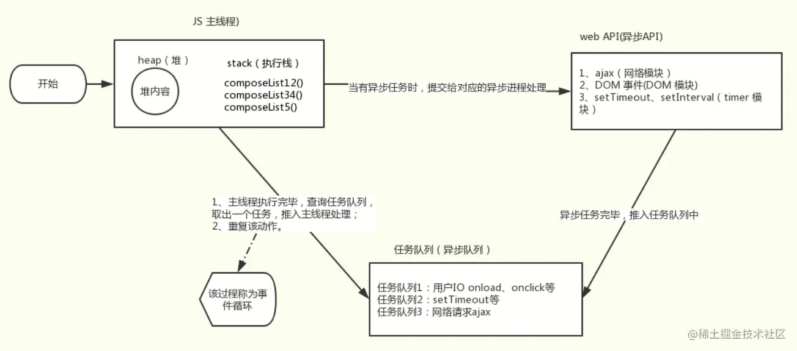
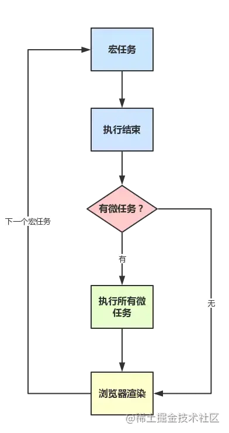

浏览器中拥有很多线程，我们的 js 代码在主线程中执行，是单线程的

普通的代码都是同步代码，一行接着一行执行，需要抛给其它线程执行的代码为异步代码，所以需要一个机制来让其能处理异步代码，那就是 `Event Loop`(`事件循环`)

下面是 js 执行大致架构：



- 有一个调用栈来放置需要执行的代码，先进先出

- 执行我们代码的时候，会把每一行代码推进调用栈

- 接着从栈顶开始调用其执行执行上下文，从堆空间(一般是存储对象)和栈空间(一般存储非对象值以及对象引用)取数据，进而处理当前调用栈所用到的数据

- 遇到异步代码时，会根据异步任务类型分发给浏览器其它线程

- 异步任务结束时会把回调推入一个异步任务队列，主线程执行完后，会在这个队列里获取任务压入调用栈执行

异步任务分为两种，**宏任务**和**微任务**

其执行逻辑大致如下：



- 代码中的同步代码为一个宏任务，推入宏任务队列

- 取出一个宏任务执行

- 执行结束后判断是否有微任务

- 有就执行所有微任务

- 执行完微任务或没有微任务，浏览器更新渲染

- 是否有宏任务，有就回到第二步

- 没有就回到第三步

## 宏任务

`setTimeout`,`setInterval`,`事件回调`,`网络请求回调` 等都是宏任务

根据上面的事件循环逻辑可以得知，微任务优先级更高，执行下面代码：

```javascript
setTimeout(() => console.log('timeout'));
new Promise((resolve) => resolve(true)).then(() => console.log('promise'));
console.log('main');
```

结果是：

```
main
promise
timeout
```

## 微任务

`Promise`,`MutationObserver` 等等都是微任务

ES6 中的 `async`,`await` 其实是 `Promise` 的语法糖，也算是微任务
