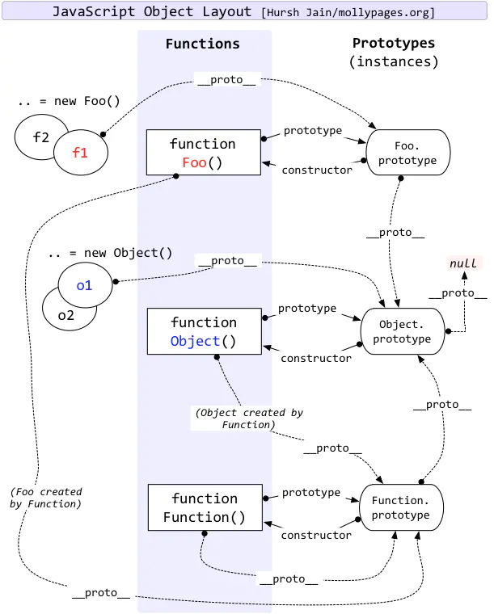

# 前言

最近在恶补 JS 基础，什么闭包、作用域链、词法环境、事件循环 balabala...人都补傻了...

大概这就是半路出家学前端的代价吧 QAQ。

今天先来把最近刚刚啃透的**原型链**知识梳理一下。

<!--truncate-->

# 几个概念

这几个概念是理解原型链的基础，**非！常！重！要！**

## 万物皆为对象

在 JS 中，除了 `null`、`undefined` 之外的**所有数据类型**都是对象。

没错， `NaN` 也是对象，`NaN` 本质上是 `number`。

### 普通对象

就是对象（废话）。

普通对象都会拥有 `__proto__` 属性。

- `{}` 是普通对象。
- `var foo = new Foo()` ，`foo` 是普通对象。
- `"abc"` 是普通对象。
- `123` 是普通对象。
- `NaN` 也是普通对象。

### 函数对象

就是函数。

函数对象都会拥有 `prototype` 属性，函数对象同时也是普通对象，所以也拥有 `__proto__` 属性。

- `function A() {}` 是一个函数对象。
- `String`、`Number`、`Object`、`Function` 等都是函数对象。

### 普通对象是函数对象的实例

下面这几个例子看一下，相信就能理解了

- `{}` 是 `Object` 的实例，我们平时看到的 `var obj = {}` 其实等于 `var obj = new Object({})`

- `foo` 是 `function Foo() {}` 的实例

  ```javascript
  function Foo() {}
  var foo = new Foo();
  ```

- `"abc"` 是 `String` 的实例

- `123` 是 `Number` 的实例

- `NaN` 也是 `Number` 的实例

### prototype

`prototype` 即是对象的原型

### \_\_proto\_\_

`__proto__` 串起原型形成了原型链，可以理解 `__proto__` 指向该对象继承的父对象

## 几个准则

总结出来的几个规律，能记住基本上**吴迪**！

### 准则一

普通对象的 `__proto__` 指向实例化它的函数对象的 `prototype`。

所以：

> `__proto__` 串起原型形成了原型链

#### 例子

```javascript
function Foo() {}
var foo = new Foo();

foo.__proto__ === Foo.prototype; // true
```

### 准则二

**函数对象**的原型上的 `constructor` 指向函数对象本身。

#### 例子

```javascript
function Foo() {}

Foo.prototype.constructor === Foo; // true
```

### 准则三

**函数对象**都是 `Function` 类型的**实例**，包括 `Object`，也包括 `Function` 本身。

#### 例子

```javascript
function Foo() {}

Foo.__proto__ === Function.prototype; // true
String.__proto__ === Function.prototype; //true
Object.__proto__ === Function.prototype; //true
Function.__proto__ === Function.prototype; // true
```

### 准则四

除了 `Object` 以外的函数对象的原型都继承于 `Object` 的原型

`Object` 的原型继承于 `null`，即原型链的顶端为 `null`

#### 例子

```javascript
function Foo() {}

Foo.prototype.__proto__ === Object.prototype; // true
String.prototype.__proto__ === Object.prototype; // true
Number.prototype.__proto__ === Object.prototype; // true
Boolean.prototype.__proto__ === Object.prototype; // true
Function.prototype.__proto__ === Object.prototype; // true

Object.prototype.__proto__; // null
```

### 准则五

获取普通对象的属性时，若不能在普通对象本身上找到，则去**原型链**上获取。

即先从其 `__proto__` 上获取，若还是没有，则继续去其 `__proto__.__proto__` 上获取，直到**原型链顶端**或**找到为止**。

#### 例子

`foo` 上并未定义 `toString` 方法，但是能拿到，是因为会在原型链上找。

```javascript
function Foo() {}
var foo = new Foo();

foo.toString; // ƒ toString() { [native code] }
```

`test` 未定义且原型链上也找不到该属性，所以会报错；  
若在 `Object` 的原型上加上该属性的话，即可获取到，也证明了原型链的逻辑。

```javascript
foo.test; // Uncaught ReferenceError: foo is not defined
Object.prototype.test = 'test';
foo.test; // "test"
```

### 准则六

所有某一对象的实例，**共享同一个对象原型**，对象原型是一个 `Object` 的实例；

已经创建的实例的 `__proto__` 引用不会改变；

若对象原型设置为了非引用类型，则新的实例的 `__proto__` 会直接指向 `Object.prototype`。

#### 例子

引用相同。

```javascript
function Foo() {}
Foo.prototype.test = '1';
var foo1 = new Foo();
var foo2 = new Foo();

foo1.__proto__ === foo2.__proto__; // true
foo1.test; // "1"
foo2.test; // "1"

Foo.prototype.test = '2';

foo1.test; // "2"
foo2.test; // "2"
```

改变引用。

```javascript
Foo.prototype = { newTest: 1 };
var foo3 = new Foo();

foo1.test; // "2"
foo2.test; // "2"
foo1.__proto__ === foo2.__proto__; //true
foo2.__proto__ === foo3.__proto__; //false
foo3.test; // undefined
foo3.newTest; // 1
```

设置原型为非引用类型。

```javascript
Foo.prototype = 'test';
var foo4 = new Foo();

foo4.__proto__ === Foo.prototype; // false
foo4.__proto__ === Object.prototype; // true
```

# 总结

我个人就不总结了，直接上一张非常经典的图，这张图比任何总结都来的直观。

如果能利用上面的原理、准则过一遍，基本上就没问题了！


