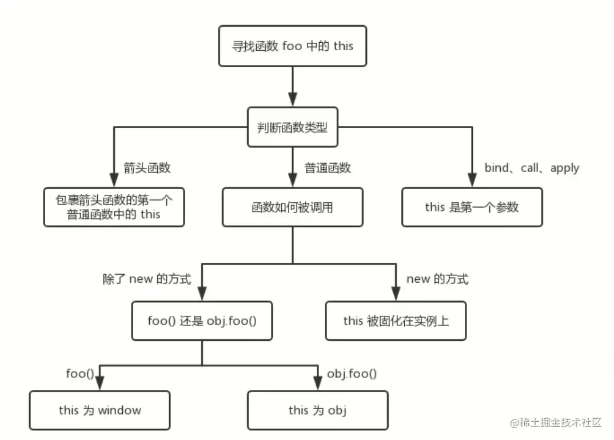

> 本文参考了：[2.6 万字 JS 干货分享，带你领略前端魅力！- 第七节](https://juejin.cn/post/6844904136161361933#heading-35)

我们先看一张图，看完基本能懂：



同时要注意几点：

- 浏览器环境下，最外层的 `this` 指向 `window`

- node 环境下，最外层的 `this` 指向 `global`

- 严格模式下最外层 `this` 指向 `undefined`

## 箭头函数

- this 指向函数外最近的 this

  ```javascript
  // 在浏览器中直接执行，this 指向外部最近的 this 也就是 window
  (() => console.log(this))(); // ▶ Window { ... }
  ```

- 无法通过 `call`,`apply`,`bind` 改变 `this` 指向

  ```javascript
  const fn = () => console.log(this);
  // 打印的依旧是 window
  fn.call('str'); // ▶ Window { ... }
  fn.apply('str'); // ▶ Window { ... }
  fn.bind('str')(); // ▶ Window { ... }
  ```

## bind, call, apply

普通函数可以使用 `call`,`apply`,`bind` 方法改变 `this` 指向

```javascript
function fn() {
  console.log(this);
}
fn(); // ▶ Window { ... }
fn.call(233); // ▶ Number {233}
fn.apply(233); // ▶ Number {233}
fn.bind(233)(); // ▶ Number {233}
```

## 普通函数的调用方式

- 调用某对象上的函数

  其 `this` 指向该对象

  ```javascript
  const obj = {
    value: 'Im value',
    fn() {
      console.log(this);
    },
  };
  obj.fn(); // ▶ {value: 'Im value', fn: ƒ}
  ```

- 通过 `new` 实例化的对象上的方法

  其 `this` 指向实例本身

  ```javascript
  function Foo() {
    this.value = 'Iam value';
    this.fn = function () {
      console.log(this);
    };
  }
  const obj = new Foo();
  obj.fn(); // ▶ Foo {value: 'test', fn: ƒ}
  ```

- 直接通过函数名调用

  其 `this` 指向全局 `this`

  ```javascript
  function fn() {
    console.log(this);
  }
  fn(); // ▶ Window { ... }
  ```

  上面两种情况都会被这个规则影响

  ```javascript
  const obj = {
    value: 'Im value',
    fn() {
      console.log(this);
    },
  };
  const fn = obj.fn;
  fn(); // ▶ Window { ... }
  ```

  ```javascript
  function Foo() {
    this.value = 'Iam value';
    this.fn = function () {
      console.log(this);
    };
  }
  const obj = new Foo();
  const fn = obj.fn;
  fn(); // ▶ Window { ... }
  ```
