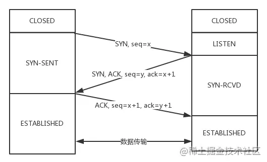
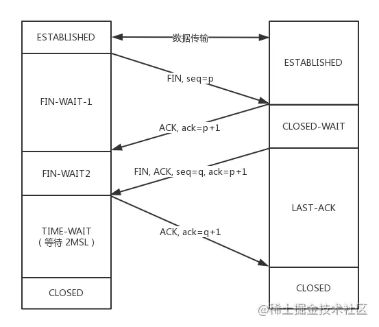

> 本文参考了：[TCP协议灵魂之问](https://juejin.cn/post/6844904070889603085)

## 简介

TCP 是一个**面向连接**的、**可靠**的、**基于字节流**的传输层协议

1. **面向连接**：指的是客户端和服务器的连接，在双方互相通信之前，TCP 需要三次握手建立连接

2. **可靠**：

   - **有状态**：TCP 会精准记录哪些数据发送了，哪些数据被对方接收了，哪些没有被接收到，而且保证数据包按序到达，不允许半点差错
   - **可控制**：当意识到丢包了或者网络环境不佳，TCP 会根据具体情况调整自己的行为，控制自己的发送速度或者重发

3. **基于字节流**：TCP 为了维护状态，将一个个 IP 包变成了字节流

## 建立连接

老生常谈的 TCP 建立连接的**三次握手**

### 第一次握手

客户端向服务端发问，询问是否准备好建立连接

- 客户端、服务端状态 `CLOSED`

- 服务端状态监听某个端口，状态变为 `LISTEN`

- 客户端发送 `SYN` 和序列号 `seq = x`，状态变为 `SYN-SENT`

### 第二次握手

服务端回答客户端准备好建立连接了，并询问是否做好了准备建立连接

- 服务端接收到 `SYN` 和序列号 `seq = x`

- 服务端发送 `ACK` 和确认号 `ack = x + 1` 以回应客户端的 `SYN`；同时发送 `SYN` 和序列号 `seq = y` 确认客户端状态

- 服务端状态变为 `SYN-RCVD`

### 第三次握手

客户端回应服务端我好好的，可以开始传输数据了

- 客户端接收到服务端的回应

- 客户端发送 `ACK` 回应服务端的 `SYN`，同时带上了 `seq = x + 1`, `ack = y + 1`

- 客户端状态变为 `ESTABLISHED`

- 服务端接收到客户端回应，状态变为 `ESTABLISHED`

### 为什么不是两次？

假设客户端发送请求建立连接 `A`，因为网络延迟超时了，重新发送请求建立了连接 `B`，数据交互完成断开了连接 `B`

但是，建立连接 `A` 的请求在这之后到达了服务端，因为只有两次握手，服务端接收到 `SYN` 并返回 `ACK`,`SYN` 后会判断建立了连接，但实际上这时客户端没有在维护这个连接，会造成资源浪费

如有第三次握手，那么服务端在发送 `ACK`,`SYN` 后，还需要客户端回应才会建立连接，客户端长时间没有回应，该连接就超时作废了，不会浪费资源

## 断开连接

需要进行**四次挥手**

### 第一次挥手

客户当告诉服务端我想要断开连接

- 客户端、服务端状态为 `ESTABLISHED`

- 客户端发送 `FIN` 和序列号 `seq = p`，状态变为 `FIN-WAIT-1` 等待断开连接第一状态

### 第二次挥手

服务端告诉客户端我收到了，让我发完剩余的数据再通知你

- 服务端接收到 `FIN` 和序列号 `seq = p`

- 服务端发送 `ACK` 回应 `FIN`，并附带确认号 `ack = p + 1`

- 服务端状态变为 `CLOSED-WAIT` 等待关闭状态，继续发送之前连接时还未发送完的数据

- 客户端收到 `ACK` 和确认号 `ack = p + 1`，状态变为 `FIN-WAIT-2` 等待断开连接第二状态

### 第三次挥手

服务端处理完剩余数据，通知客户端我要关闭连接了

- 服务端发送 `FIN`, `ACK`，并附带序列号 `seq = q` 和确认号 `ack = p + 1`

- 服务端状态变为 `LAST-ACK`，等待客户端的最后一次确认

### 第四次挥手

客户端接收到服务端的关闭通知后，等待 `2MSL` 时间后，回答服务端知道了

- 客户端接收到 `FIN`, `ACK`，序列号 `seq = q` 和确认号 `ack = p + 1`

- 客户端状态变为 `TIME-WAIT`，进入时间等待状态

- 客户端等待 `2MSL` 时长后，发送 `ACK` 和确认号 `ack = q + 1`，状态变为 `CLOSED`

- 服务端接收到回答后，状态变为 `CLOSED`

### 为什么不是三次？

三次一般指的是第二、三次合并，服务端收到 `FIN` 后等待剩余数据传输完成一次性返回 `ACK`,`FIN` 给客户端

这里会造成一个问题，如果剩余数据量过大，太长时间没有回应客户端的 `FIN`，客户端可能会认为超时并不断重复发送 `FIN`，造成资源上的浪费

### 等待 2MSL 的意义

我们每次发送报文都需要时间，MSL (`Maximum Segment Lifetime，报文最大生存时间`)

等待过程中，如果没有收到服务端的重发请求，那么表示 `ACK` 成功到达，挥手结束，否则客户端重发 `ACK`

- 第一个 MSL 为了保证客户端的 `ACK` 肯定能到达服务端

- 第二个 MSL 为了保证服务端如果没有收到 `ACK` 的情况下，服务端重新传递给客户端的 `FIN` 肯定能到达

## 半连接、全连接队列

服务端保存连接的队列

- 半连接队列：第二次握手后的连接会推入其中

- 全连接队列：第三次握手后的连接会推入其中

## SYN Flood 攻击 (DDoS)

SYN Flood 属于典型的 DoS/DDoS 攻击

原理很简单，就是伪造**大量的不存在的** IP 地址，接着在短时间内向服务器发送大量 `SYN`（第一次握手请求），服务器会因此出现以下问题：

1. 收到大量的 `SYN` 接着回应 `ACK`，会产生大量的 `SYN_RCVD` 状态的连接，会占满**半连接队列**，服务器难以处理到正常请求

2. 因为是不存在的 IP，服务器收不到 `ACK`，会导致服务器不停的重试发送数据，占用服务器资源

## TCP 报文头部字段

报文头部结构如图所示

### 源端口、目标端口

TCP 协议通过源 IP、目标 IP、源端口、目标端口来唯一标识一个连接

TCP 报文头部中只有端口信息而没有 IP，这是因为 IP 层已经处理了 IP，TCP 只需要知道端口就行

### 序列号

即 `Sequence number`， 指的是本报文段第一个字节的序列号

序列号长度为 4 字节，是 32 位无符号整数，范围 0 ~ 2^32 - 1，达到最大值循环至 0

序列号用于保证数据包按正确的顺序组装

TCP 会在 SYN 报文中互相交互双端的**初始序列号** `Initial Sequence Number`(`ISN`)

ISN 并不是固定的值，它每 4ms 会加一，溢出回到 0，这样做是为了增加 TCP 攻击的难度

### 确认号

即 `ack`(`Acknowledgment number`)，用来告知对方下一个期望接收的**序列号**，小于 ack 的所有字节已经全部收到，用于确保数据是按顺序传输的

前面第二次握手时，服务端发送给客户端的 `ack = x + 1` 就是这个作用，告诉客户端序列号小于 `x + 1` 的数据包已经处理好了，你可以发送序列号为 `x + 1` 的数据包了

### 标记位

用于标记该报文的作用、通信目的

常见的有 `SYN`,`ACK`,`FIN`,`RST`,`PSH`

SYN、ACK、FIN 在握手里体现的比较清楚了，但还是简单解释下：

- `SYN`：用于确认对方状态，同步**ISN(初始序列号)**

- `ACK`：用于回应对方的请求

- `RST`：Reset，用于强制断开连接

- `PSH`：Push，告知对方这些数据包收到后应该马上交给上层的应用，不能缓存

### 窗口大小

发送、接收数据的缓冲区大小，用来进行流量控制

图里显示占用 2 字节 16 位，实际这样是不够的，所以 TCP 引入了窗口缩放，能动态调整窗口大小

### 校验和

用于校验数据是否有差错，防止传输中被损坏的数据被接收，如果遇到校验有错的报文，会直接丢弃，等待对方重新发送

### 可选项

可选项结构如下

常用可选项有这些：

- TimeStamp: TCP 时间戳，后面介绍

- MSS: 指的是 TCP 允许的从对方接收的最大报文段

- SACK: 选择确认选项

- Window Scale： 窗口缩放选项

## 时间戳

时间戳 `timestamp` 为可选项

长度 10 字节，除了可选结构中的 `kind`, `length` 之外，其本身信息占 8 字节

### 计算往返延迟 RTT

- 例子一：发送一个数据包，因为网络原因超时，发送了第二次，接着服务端响应了 `ACK`，这种情况下是用第一次的发送时间还是第二次的发送时间来计算 RTT 呢？

- 例子二：发送一个数据包，因为网络原因超时，发送了第二次，但是就在很短的时间后，服务端立即回应了第一次请求的 `ACK`，这种情况下是用第一次的发送时间还是第二次的发送时间来计算 RTT 呢？

怎样的算法都会有一定的偏差，并且还会有算法的额外开销，于是就轮到时间戳 `timestamp` 登场了

时间戳的使用分为以下几步：

- a 向 b 发送报文，头部存放了时间戳 `ta1`

- b 接收到报文后，向 a 回复发送报文，头部存放了 a 的 `ta1` 和 b 自身当前的时间戳

- a 接收到 b 的回复，根据报文头部中的 `ta1` 和自身当前的时间戳 `ta2` 来计算 `RTT = ta2 - ta1`

这样计算出来的 RTT 是准确无误的

### 防止序列号冲突

前面说过，序列号溢出后会归 0 重新计数

假设有一个序列号为 0 ~ 1 的数据，因为网络波动卡在返回路上

等待了很久后序列号已经开始了第二轮计数，并且成功接收**第二轮**序列号为 0 ~ 1 的数据，就在这时**前一轮** 0 ~ 1 的数据终于回来了

这个情况下就有两个序列号相同的数据包，如何区分这两个数据包？

答案是时间戳，因为**同一个序列号**的请求，发送**时间必然不同**

## TFO (TCP 快速打开)

是三次握手的一些优化，我们平时进行 http 请求，服务端需要在三次握手后才会响应

而 TFO 可以在**第二次握手**时就响应

具体实现：

- 在**首次建立连接**的第二次握手时，服务器还会额外在响应报文中添加一个 `Fast Open` 数据，里面存放的是经过计算得到的 `SYN Cookie`，客户端拿到后会**缓存**下来

- 后续客户端进行 http 请求时，会在第一次握手时带上 `SYN Cookie` 和 **HTTP 请求**，服务端在校验 `SYN Cookie` 合法后会在响应（第二次握手）的同时**返回 HTTP 请求的响应**
