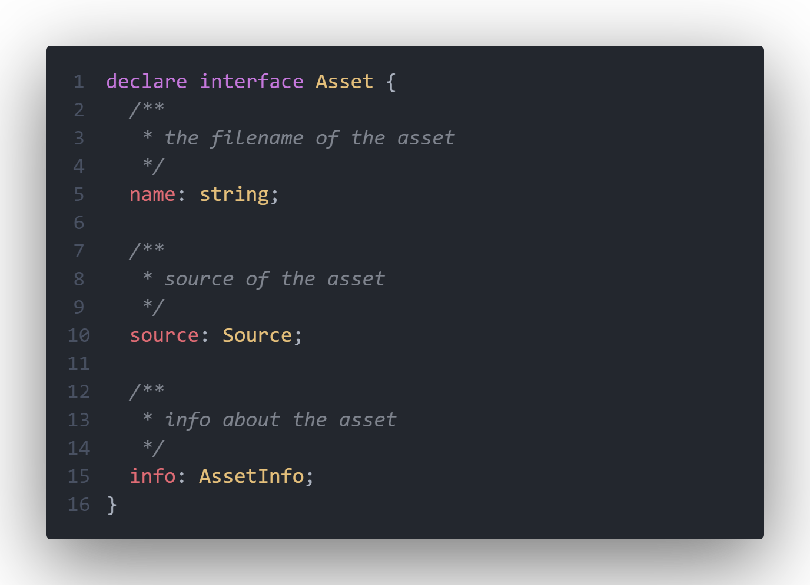
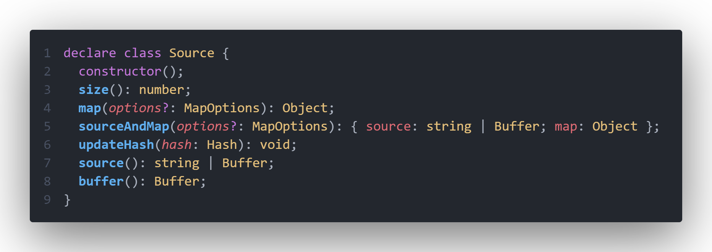
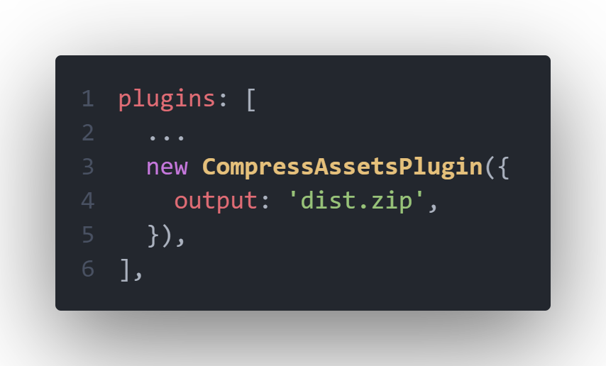
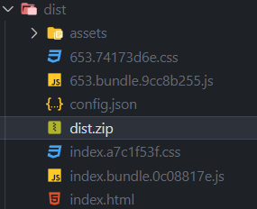

> 本文参考了：[超硬核｜带你畅游在 Webpack 插件开发者的世界](https://juejin.cn/post/7047777251949019173)

## 需求

- 需要把打包的所有产物压缩到一个 `zip` 文件中

- 可以定义文件名

## 思路

- 需要找到能获取生成完毕后的文件资源的钩子

- 遍历所有文件，使用第三方库压缩文件，我们这边使用 `jszip`

## 实现

- 查阅[文档](https://www.webpackjs.com/api/compiler-hooks/#emit)可知 `emit` 为在文件输出前的钩子，该钩子为**异步串行**钩子，其回调参数为 [`compilation`](https://webpack.docschina.org/api/compilation-object/) 对象

  `compilation` 对象能通过 `getAssets` 函数获得所有的资源数组

- 我们通过 `typescript` 类型声明文件发现，`asset` 对象结构如下

  

- 其中的 `source` 对象结构如下

  

  其中的 `source` 函数就是我们所需要的

- 继续查阅[文档](https://webpack.docschina.org/api/compilation-object/#emitasset)得知 `compilation.emitAsset` 方法可以增加输出的文件

  其第二个参数 `source` 对象需要通过 [`webpack-source`](https://github.com/webpack/webpack-sources#readme) 这个库来创建

最后实现的完整代码如下：

```javascript
import JSZip from 'jszip';
import { RawSource } from 'webpack-sources';

const pluginName = 'CompressAssetsPlugin';
class CompressAssetsPlugin {
  // 在配置文件中传入的参数会保存在插件实例中
  constructor({ output }) {
    // 接受外部传入的 output 参数
    this.output = output;
  }

  /**
   * apply
   * @param {import('webpack').Compiler} compiler
   */
  apply(compiler) {
    // AsyncSeriesHook 将 assets 输出到 output 目录之前调用该钩子
    compiler.hooks.emit.tapAsync(pluginName, (compilation, callback) => {
      // 创建 zip 对象
      const zip = new JSZip();
      // 获取本次打包生成的所有资源
      const assets = compilation.getAssets();
      // 循环每一个资源
      assets.forEach(({ name, source }) => {
        // 获得名字
        // 同时调用 source() 方法获得对应的文件的 string 或 buffer
        // 添加进 zip 对象中
        zip.file(name, source.source());
      });
      // 调用 zip.generateAsync 生成 zip 压缩包
      zip.generateAsync({ type: 'nodebuffer' }).then((result) => {
        // 通过 new RawSource 创建 webpack 资源来源
        // 接着通过 compilation.emitAsset 方法将生成的压缩包通过资源来源对象输出到名为 this.output 的文件中
        compilation.emitAsset(this.output, new RawSource(result));
        // 调用 callback 表示本次事件函数结束
        callback();
      });
    });
  }
}

export default CompressAssetsPlugin;
```

## 使用

在配置文件中引入插件并使用



打包产物


