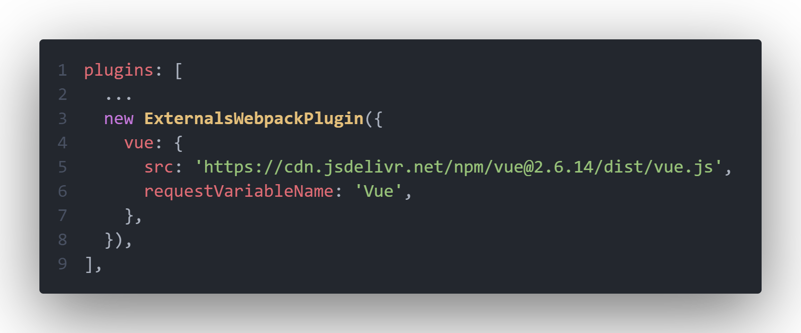

> 本文参考了：[超硬核｜带你畅游在 Webpack 插件开发者的世界](https://juejin.cn/post/7047777251949019173)

## 需求

有时候我们需要从 `CDN` 而不是代码中引入依赖，`webpack` 提供了 [`external`](https://webpack.docschina.org/configuration/externals/) 字段供我们配置

该配置有一个缺点，设置为外部依赖后的包，不知道代码中有没有使用，以防万一我们需要在 `index.html` 中写 `script` 标签注入依赖，例如引入 `lodash`：

```html
<!DOCTYPE html>
<html>
  <head>
    <meta charset="utf-8" />
    <title>Webpack App</title>
    <meta name="viewport" content="width=device-width, initial-scale=1" />
    <!-- 从 CDN 引入了 lodash -->
    <script src="https://cdnjs.cloudflare.com/ajax/libs/lodash.js/4.17.21/lodash.min.js"></script>
  </head>

  <body></body>
</html>
```

这样在实际没有使用该依赖时，会**造成额外网络请求开销**，**影响页面加载速度**

那么需要解决的问题就很明确了：

- 每次增加 `externals` 时，需要在 `html` 中同步增减，步骤繁琐

- `CDN` 冗余问题

需求可以被转换成这样：

- `CDN` 可以在插件中配置，自动注入到 `html` 文件中

- 只注入代码中出现过的依赖

## 思路

> 默认大家都使用了 `html-webpack-plugin` 插件（web 项目一般都会有）

我们其实只需要在原生 `externals` 的基础上加多个配置填入 `CDN` 即可，假设有下面依赖通过 `CDN` 引入后会挂载到 `window.Vue`：

```javascript
import VueModule from 'vue';
...
```

原生 `externals` 配置应该长这样：

```javascript
const webpackConfig = {
  ...
  externals: {
    // 因为给 web 端用，默认在 window 上获取
    vue: 'window Vue',
  },
};
```

我们的插件配置应当长这样：

```javascript
const externalPluginConfig = {
  vue: {
    src: 'https://cdn.jsdelivr.net/npm/vue@2.6.14/dist/vue.js',
    requestVariableName: 'Vue',
  },
};
```

那么插件处理配置的步骤应当拆解成这几步：

1. 在解析模块的钩子中，若模块在插件配置中，使用 `webpack` 内置的 `ExternalModule` 构建外部模块并返回

   以确保原生的 `externals` 行为一致

2. 在编译代码的钩子中，在每次解析到 `import` 语句和调用 `require` 方法时，若模块在插件配置中，则添加进一个 `Set` （去重）保存

   以达到筛选出现在代码中的模块的目的

3. 使用 `html-webpack-plugin` 插件的钩子，在其构建好引入资源的标签对象的钩子中，将 `Set` 中的存在的模块的 `src` 添加到标签对象队列的头部

   以达到解决 `CDN` 冗余和需要在 `html` 中手动添加的问题

## 实现

```javascript
import { ExternalModule } from 'webpack';
import HtmlWebpackPlugin from 'html-webpack-plugin';

const pluginName = 'ExternalsWebpackPlugin';

class ExternalsWebpackPlugin {
  constructor(options) {
    // 存放全部参数
    this.options = options;
    // 存放插件参数的模块名
    this.transformLibrary = Object.keys(options);
    // 存放有被代码实际引入的模块名
    // 通过分析 AST 添加
    this.usedLibrary = new Set();
  }

  /**
   * apply
   * @param {import('webpack').Compiler} compiler
   */
  apply(compiler) {
    // normalModuleFactory 创建后会触发该事件监听函数
    compiler.hooks.normalModuleFactory.tap(
      pluginName,
      (normalModuleFactory) => {
        // 在每次初始化解析模块之前调用
        normalModuleFactory.hooks.factorize.tapAsync(
          pluginName,
          (resolveData, callback) => {
            // 获取引入的模块名称
            const requireModuleName = resolveData.request;
            // 如果当前模块需要被处理为外部依赖
            if (this.transformLibrary.includes(requireModuleName)) {
              // 先获得当前模块需要转位成为的变量名
              const externalModuleVariableName =
                this.options[requireModuleName].requestVariableName;
              // webpack 会根据该 hook 的返回值来决定该模块引用方式
              // 返回一个新的外部依赖模块就会以外部依赖的形式引用
              callback(
                null,
                new ExternalModule(
                  externalModuleVariableName,
                  // https://github.com/webpack/webpack/blob/e184a03f2504f03b2e30091662df6630a99a5f72/lib/ExternalModule.js#L512-L613
                  'window', // 从 window[externalModuleVariableName] 获得模块
                  externalModuleVariableName
                )
              );
            } else {
              // 正常编译
              callback();
            }
          }
        );

        // 在编译模块时触发
        normalModuleFactory.hooks.parser
          .for('javascript/auto')
          .tap(pluginName, (parser) => {
            // 当遇到模块引入语句 import 时
            parser.hooks.import.tap(pluginName, (statement, source) => {
              // 如果模块需要被改为外部依赖
              if (this.transformLibrary.includes(source)) {
                // 加入到 Set
                this.usedLibrary.add(source);
              }
            });

            // 当遇到模块引入语句 require 时
            parser.hooks.call.for('require').tap(pluginName, (expression) => {
              // require 的第一个参数就是模块名
              const moduleName = expression.arguments[0].value;
              // 如果模块需要被改为外部依赖
              if (this.transformLibrary.includes(moduleName)) {
                // 加入到 Set
                this.usedLibrary.add(moduleName);
              }
            });
          });
      }
    );

    compiler.hooks.compilation.tap(pluginName, (compilation) => {
      // 获取 HTMLWebpackPlugin 拓展的 compilation Hooks
      HtmlWebpackPlugin.getHooks(compilation).alterAssetTags.tap(
        pluginName,
        (data) => {
          // 获得 script 标签对象数组
          const scriptTag = data.assetTags.scripts;
          // 根据 Set 在数组头部添加引入对应 CDN 的 script 标签对象
          this.usedLibrary.forEach((library) => {
            scriptTag.unshift({
              tagName: 'script',
              voidTag: false,
              meta: {
                plugin: pluginName,
              },
              attributes: {
                defer: true,
                type: undefined,
                src: this.options[library].src,
              },
            });
          });
          return data;
        }
      );
    });
  }
}

export default ExternalsWebpackPlugin;
```

## 使用

在配置文件中引入插件并使用



`index.html` 文件

```html
<!DOCTYPE html>
<html lang="en">
  <head>
    <meta charset="UTF-8" />
    <meta http-equiv="X-UA-Compatible" content="IE=edge" />
    <meta name="viewport" content="width=device-width,initial-scale=1" />
    <title>webpack-plugin-test</title>
    <!-- 成功注入了 -->
    <script
      defer="defer"
      src="https://cdn.jsdelivr.net/npm/vue@2.6.14/dist/vue.js"
    ></script>
    <script defer="defer" src="index.bundle.a04e601c.js"></script>
    <link href="index.a7c1f53f.css" rel="stylesheet" />
  </head>
  <body>
    <div id="app"></div>
  </body>
</html>
```
