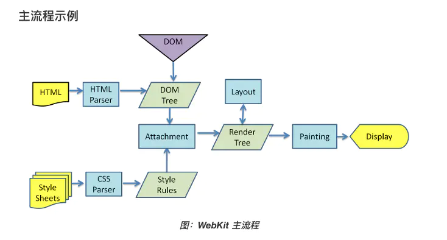
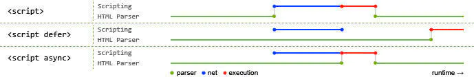

# QA

<br/>

## Vue 和 React 区别

* vue 双向数据流；react 单向数据流
* vue 封装的更全面，不需要开发者手动更新组件；react 需要开发者自行斟酌是否更新组件

<br/>

<!--truncate-->

## Vue 为什么不用手动判断是否更新组件

这里涉及到 Vue 双向绑定的原理。

Vue2 中通过 `Object.defineProperty` 劫持了数据，数据变化时，会通知订阅器，订阅器会让订阅了数据的视图更新。

<br/>

## React 可以怎么优化

* `useMemo` 缓存函数结果、缓存函数组件
* `React.memo` 缓存类组件
* 类组件中的 `shouldComponentUpdate` 生命周期钩子
* `React.PureComponent` 内置状态、参数的**浅比较**实现

<br/>

## 父组件下有两个子组件，子组件中更新了自身的状态，哪些生命周期钩子会被调用

更新了状态的子组件会从上到下调用以下生命周期钩子函数


<br/>

## 什么是深浅比较

* 浅比较会比较**基础类型的类型和值是否相当**，引用类型的**引用是否相同**
* 深比较会深入比较引用类型内部的值

<br/>

## "==" 是什么比较， "===" 呢

`===` 和 `==` 在**类型相同且对比引用类型时**，实现上都是**浅比较**；  
如果包括基础类型，`==` 比较的更”深入“可以理解成”深比较“，`===` 比较的较”浅“可以理解成浅比较。

* `==` 若类型不同，转换成相同类型（优先转 `number`）的再比较，若是引用类型，则会调用其 `valueOf` 方法获取其值后再转换；若类型相同，则比较其值，引用类型比较引用是否相同。

* `===` 类型不同直接不相等，若类型相同则与 `==` 的类型相同规则一致。

```javascript
var obj1 = {
  valueOf() {
    return 1
	}
}

1 == obj1 // true
1 === obj1 // false
1 == '1' // true
1 === '1' // false
```

<br/>

## es6 新特性

* 新的数据解构 Set、Map
* Reflect、Proxy、Promise 对象
* let、const 命令
* 局部作用域概念
* Class 语法

<br/>

## es6 解构是深拷贝还是浅拷贝

浅拷贝

<br/>

## 能够完整的深拷贝一个 function 吗

不行

<br/>

## 说下深拷贝思路

写一个方法遍历对象所有属性的值并赋予给新对象，若值为引用类型，则递归方法本身。

```javascript
const deepClone = (obj, target) => {
  Object.keys(target).forEach((key) => {
    if (typeof target[key] === 'object')
      (obj[key] = {}) && deepClone(obj[key], target[key]);
    else obj[key] = target[key];
  });
  return obj;
};

const obj = {};
const a = { a: 1 };
const b = { a: a, b: 2 };
deepClone(obj, b);

b.a === a // true
obj.a === a // false
```

<br/>

## es6 有什么 api 能实现递归

> 这个我查了半天愣是找不出..

<br/>

## 用 webpack 配置过些什么

* loader
  * jsx-loader
  * css-loader
  * file-loader
  * url-loader
  * scss-loader
* plugin
  * 压缩 css 插件
  * post-css 插件
  * 热更新

<br/>

## webpack 插件、loader 执行顺序

先默认按照**倒序**执行 loader（可以配置优先级），plugin 会监听其对应的事件来处理经过 loader 的文件，不用管理其执行顺序。

<br/>

## 浏览器拿到一个 html 后如何加载它

* 解析文件，同时形成 `DOM Tree` 和 根据 css 生成 `Style Rules`，css 解析会阻塞渲染，`Style Rules` 构建完毕后才会进行下一步
* 在解析过程中若有外部 js 则会暂停解析，去获取 js 并运行，运行完成后继续解析


* 解析完后 `DOM Tree` 和 `Style Rules` 合成为 `Render Tree`

* 然后是 `layout`（布局）阶段，计算出每个节点在屏幕上的**确切位置**和**大小**

* 最后把 `Render Tree` 渲染在屏幕上

  

<br/>

## 外部 script 和 外部 css 获取会阻塞进程吗

### 外部 css

一定会阻塞

### script 标签

默认也会阻塞，但在 html5 标准中增加了两个属性 `async ` `defer`，只对外部脚本有效

* `async` 作用就是字面意思，异步加载，不会阻塞主线程；特点是加载后立即执行脚本，所以可能不会按照 script 标签的顺序执行，执行时依旧会阻塞
* `defer` 也会异步加载；特点是加载后不会立即执行脚本，等待文档所有元素解析完后，脚本会在 `DOMContentLoaded` 事件触发之前执行



<br/>

## script 标签里的代码会阻塞浏览器吗

会阻塞。

<br/>

## 浏览器扫描到 img 加载图片是异步还是同步

异步，不会阻塞主线程

<br/>

## 讲下 http 缓存

### http1.0 

* 响应头中可以添加 `Expires` 字段，值是一串**绝对时间**字符串，浏览器看到之后会把这个资源连同 `response header` 一起缓存
* 再次请求该资源时，会先从缓存找，找到资源后，拿出其 `Expires` 字段跟当前请求时间进行比较，若在 `Expires` 之前，则命中缓存，否则去服务器获取资源

### http1.1

* 因为 http1.0 中的 `Expires` 字段是某服务器的**绝对时间**，若用户和服务器不在同一时区，则会出现缓存无效、缓存时间错误等问题
* http1.1 中增加了新的 `Cache-Control` 字段，其值一般是以秒为单位的**相对时间**数值（）以解决 `Expires` 的问题，浏览器看到之后同样会把这个资源连同 `response header` 一起缓存
* 再次请求该资源时，会先从缓存找，找到资源后，拿出其 `Cache-Control` 字段与第一次请求时间计算出有效期，若当前时间在有效期以内，则命中缓存，否则去服务器获取资源
* `Cache-Control` 优先级高于 `Expires`

<br/>

## 协商缓存、强缓存是什么

### 强缓存

强缓存就是在代码中或者配置服务器的方式，手动加上 `Expires` 、 `Cache-Control` 、`Pragma` 响应头来控制缓存行为，这些字段配置后不到期不会请求服务器。

`Cache-Control` 还有有以下指令：  

* `no-store`：不使用任何缓存
* `no-cache`：协商缓存验证
* `max-age`：最基础的用法，超时相对时间秒数值
* `max-stale`：缓存过期不超过该秒数就能够缓存

`Pragma` 是用来兼容支支持 http1.0 的服务器的指令，其只有一个值 `no-cache`，效果与 `Cache-Control: no-cache` 相同

### 协商缓存

如若某个资源没有命中强缓存，就会发一个请求验证协商缓存是否命中，若命中则会返回 http 状态为 `304`，消息 `Not Modified`，告诉浏览器服务器上的该资源没有更新，浏览器可以直接去缓存中获取该资源。

响应头：

* `Last-Modified`：表示该资源在服务器上的最后修改时间
* `ETag`：服务器根据当前资源生成的唯一标识，资源变化这个标识就会变，跟最后修改时间无关

请求头：

* `If-Modified-Since`：该资源最近一次没命中缓存请求时响应头的 `Last-Modified`，服务器会根据该值判断是否需要返回新的资源；若无需更新，则返回 http 状态 `304`，消息 `Not Modified`；若需要更新则返回资源，且响应头中附上最新的 `Last-Modified`
* `If-None-Match`：该资源最近一次没命中缓存请求时响应头的 `ETag`，服务器会比较该值与资源当前 `ETag` 是否相同；若相同，则返回 http 状态 `304`，消息 `Not Modified`；反之则返回最新资源，且响应头中附上最新的 `ETag`

协商缓存会向服务器发送请求，所以如果服务器在缓存有效期前更新资源，浏览器也能及时更新；

而且若没有协商缓存，每个请求都会落到服务器，性能开销很大。

<br/>

## CI/CD 说下你的理解

### CI

持续交付，可以理解成代码更新就自动编译

### CD

持续集成，可以理解为自动部署

<br/>

