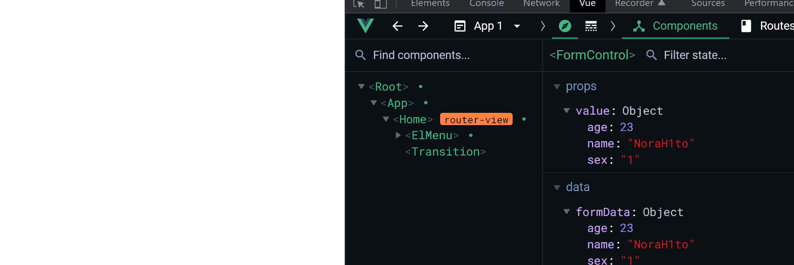

## 发生神魔事了

在 [受控表单][受控表单] 中，可以发现其封装还能进行更高层次的抽象封装

没错，就是双向绑定的封装

## 分析

[受控表单][受控表单] 的封装其实就是一个写死变量名称的双向绑定

1. 所以需要能够自定义变量名

传递对象模型 `model` 理解成本还能降低

2. 去掉 `model` 参数，让用户自己定义内部变量

可能会有多个需要实现双向绑定的属性

3. 支持 `.sync` 修饰符语法糖

为此我们可以封装两个混入 `vModel.js`, `sync.js`

## sync.js

双向绑定语法糖可以从 `.sync` 二次封装而来，所以我们先实现 `sync.js`

### 自定义变量名

`propName` 定义外部传递的属性名，`valueName` 定义内部的属性名

默认值分别为 `"value"`, `"data"`

```javascript title="mixins/sync.js" {4-7}
import { immutable } from '@/utils';

const sync = (
  { propName = 'value', valueName = 'data' } = {
    propName: 'value',
    valueName: 'data',
  }
) => ({});

export default sync;
```

### 改造受控表单代码

把之前写死的变量名分别用 `propName`, `valueName` 代替

```javascript title="mixins/sync.js {9-36}"
import { immutable } from '@/utils';

const sync = (
  { propName = 'value', valueName = 'data' } = {
    propName: 'value',
    valueName: 'data',
  }
) => ({
  // 因为是 .sync 的封装，把 model 配置去掉
  // model: {
  //   prop: `${propName}`,
  //   event: `update:${propName}`,
  // },
  props: {
    [`${propName}`]: {
      required: false,
      default: undefined,
    },
  },
  watch: {
    [`${valueName}`]: {
      handler(n) {
        this.$emit(`update:${propName}`, immutable(n));
      },
      deep: true,
    },
    [`${propName}`]: {
      handler(n) {
        if (typeof n === 'object') {
          Object.keys(n).forEach((k) => this.$set(this[valueName], k, n[k]));
        } else this[valueName] = n;
      },
      deep: true,
      immediate: true,
    },
  },
});

export default sync;
```

### 最终代码

```javascript title="mixins/sync.js"
import { immutable } from '@/utils';

/**
 * sync
 * @param {{ propName: string; valueName: string; }} config
 */
const sync = (
  { propName = 'value', valueName = 'data' } = {
    propName: 'value',
    valueName: 'data',
  }
) => ({
  props: {
    [`${propName}`]: {
      required: false,
      default: undefined,
    },
  },
  watch: {
    [`${valueName}`]: {
      handler(n) {
        this.$emit(`update:${propName}`, immutable(n));
      },
      deep: true,
    },
    [`${propName}`]: {
      handler(n) {
        if (typeof n === 'object') {
          Object.keys(n).forEach((k) => this.$set(this[valueName], k, n[k]));
        } else this[valueName] = n;
      },
      deep: true,
      immediate: true,
    },
  },
});

export default sync;
```

### 测试

使用 [受控表单][受控表单] 代码进行测试


测试代码:

```html title="index.vue"
<template>
  <form-control :value.sync="formData" />
</template>

<script>
  import FormControl from './components/FormControl/index.vue';
  export default {
    components: {
      FormControl,
    },
    data() {
      return {
        formData: {
          name: 'NoraH1to',
          sex: '1',
          age: 23,
        },
      };
    },
  };
</script>
```

```html title="components/FormControl/index.vue" {17,19-24}
<template>
  <el-form ref="form" :model="formData" label-width="80px">
    <el-form-item label="姓名" prop="name">
      <el-input v-model="formData.name"></el-input>
    </el-form-item>
    <el-form-item label="性别" prop="sex">
      <el-radio v-model="formData.sex" label="1">男</el-radio>
      <el-radio v-model="formData.sex" label="2">女</el-radio>
    </el-form-item>
    <el-form-item label="年龄" prop="age">
      <el-input-number v-model="formData.age"></el-input-number>
    </el-form-item>
  </el-form>
</template>

<script>
  import sync from '../../mixins/sync';
  export default {
    mixins: [sync({ valueName: 'formData', propName: 'value' })],
    data() {
      return {
        formData: { name: undefined, sex: '1', age: undefined },
      };
    },
  };
</script>
```

## vModel.js

直接补上前面去掉的 `model` 属性就好

### 最终代码

```javascript title="mixins/vModel.js"
import sync from './sync';

/**
 * v-model
 * @param {{ propName: string; valueName: string; }} config
 */
const vModel = (
  { propName = 'value', valueName = 'data' } = {
    propName: 'value',
    valueName: 'data',
  }
) => ({
  mixins: [sync({ propName, valueName })],
  model: {
    prop: `${propName}`,
    event: `update:${propName}`,
  },
});

export default vModel;
```

### 测试

还是基于 [受控表单][受控表单] 代码进行修改测试



测试代码:

```html title="components/FormControl/index.vue" {17,19-24}
<template>
  <el-form ref="form" :model="formData" label-width="80px">
    <el-form-item label="姓名" prop="name">
      <el-input v-model="formData.name"></el-input>
    </el-form-item>
    <el-form-item label="性别" prop="sex">
      <el-radio v-model="formData.sex" label="1">男</el-radio>
      <el-radio v-model="formData.sex" label="2">女</el-radio>
    </el-form-item>
    <el-form-item label="年龄" prop="age">
      <el-input-number v-model="formData.age"></el-input-number>
    </el-form-item>
  </el-form>
</template>

<script>
  import vModel from '../../mixins/vModel';
  export default {
    mixins: [vModel({ valueName: 'formData' })],
    data() {
      return {
        formData: { name: undefined, sex: '1', age: undefined },
      };
    },
  };
</script>
```

```html title="index.vue" {2}
<template>
  <form-control v-model="formData" />
</template>

<script>
  import FormControl from './components/FormControl/index.vue';
  export default {
    components: {
      FormControl,
    },
    data() {
      return {
        formData: {
          name: 'NoraH1to',
          sex: '1',
          age: 23,
        },
      };
    },
  };
</script>
```

## 总结

实现了 `.sync` 修饰符的混入，并基于它实现了 `v-model` 双向绑定混入

其实完全能够在 `sync.js` 中加一个参数来决定是否增加 `model` 属性以支持 `v-model`，但是如果这样的话会违背我们 **api 越少越好** 的原则，多了一个参数，增加使用者的心智负担

不如拆成独立的混入，参数完全一致，共享理解成本，并且看一眼文件名就能理解功能

[受控表单]: /docs/vue2/control-form
