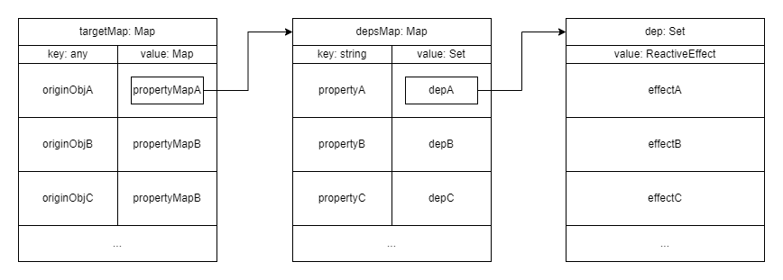

`effect` 是 `@vue/reactivity` 包中另外一个非常重要的实现，`watchEffect`,`watch` 都是基于这个实现的，该 `api` 是公开的但是并没有写入文档

`effect` 就是副作用的意思，其作用很容易理解，我放一段代码：

```html
<script setup>
  import { reactive, watchEffect, effect } from 'vue';

  const count = reactive({ value: 0 });
  const hello = reactive({ string: 'hello' });

  effect(() => console.log('count:', count.value, 'hello:', hello.string));

  const add = () => {
    count.value++;
    hello.string += hello.string;
  };
</script>
<template>
  <div>
    hello Vue3
    <button @click="add">add</button>
  </div>
</template>
```

我们打开控制台，上面会立刻打印：

```log
count: 0 hello: hello
```

点击一下 `add` 按钮，控制台会再次打印两行：

```log
count: 1 hello: hello
count: 1 hello: hello hello
```

嗯？为什么会打印两次？`watchEffect` 传入该回调应该只会执行一次啊

因为 `effect` 是偏底层的接口，它只负责最基础的行为：**追踪变化，调用回调**，并不会把多次响应合并起来，后面再看 `watchEffect` 是如何实现该特性的

## effect

我们先来看 `effect` 的实现，其内部其实挺简单的

它接收两个参数，回调 `fn` 和配置选项 `options`：

```typescript
export function effect<T = any>(
  fn: () => T,
  options?: ReactiveEffectOptions
): ReactiveEffectRunner {
  ...
}
```

- 如果 `fn` 上有 `effect`：

  ```typescript
  if ((fn as ReactiveEffectRunner).effect) {
    fn = (fn as ReactiveEffectRunner).effect.fn;
  }
  ```

  则取该 `effect` 上的 `fn`

- 构建一个 [`ReactiveEffect`](#reactiveeffect)：

  ```typescript
  const _effect = new ReactiveEffect(fn);
  if (options) {
    extend(_effect, options);
    if (options.scope) recordEffectScope(_effect, options.scope);
  }
  ```

  如果有 `options`，会使用 `options` 覆盖副作用 `_effect` 中的默认配置

  如果存在区域 `scope` ，则将该副作用记录到区域中

- 默认立即执行一次副作用：

  ```typescript
  if (!options || !options.lazy) {
    _effect.run();
  }
  ```

- 构建 `runner` 并返回：

  ```typescript
  const runner = _effect.run.bind(_effect) as ReactiveEffectRunner;
  runner.effect = _effect;
  return runner;
  ```

  `runner` 其实就是副作用的回调方法的代理（`run`），并且上面记录了副作用对象本身（`runner.effect = _effect`）

## ReactiveEffect

上一小节构建的 `ReactiveEffect`，我们来看看其实现

### 构造器

构造器很简单，就是接收一个**回调** `fn`、**调度器** `scheduler` 和**副作用区域** `scope`

**调度器**的作用比较偏底层，在 `trigger` 触发响应时会优先使用 `scheduler`，不存在才调用 `run`

构造器代码如下：

```typescript
class ReactiveEffect<T = any> {
  ...
  constructor(
    public fn: () => T,
    public scheduler: EffectScheduler | null = null,
    scope?: EffectScope
  ) {
    recordEffectScope(this, scope);
  }
  ...
}
```

这里使用了在构造器参数里定义类成员变量的语法，`fn` 和 `scheduler` 都是可以通过 `this.xxx` 访问的

构造器内部仅仅只是记录了当前副作用的区域 `scope`，不传则没有效果

### run

该函数是核心中的核心

- 首先判断自身是否活跃：

  ```typescript
  if (!this.active) {
    return this.fn();
  }
  ```

  如果不活跃，则返回执行回调的结果

  这样做的后果是响应式代理 `track` 时，由于下一步没执行， `activeEffect` 指向不是当前副作用，所以 `trigger` 时不会执行当前副作用

- 记录父副作用：

  全局变量 `activeEffect` 记录了**执行中**的副作用，新的副作用刚刚开始执行时，该变量就是上一个执行完的副作用

  ```typescript
  let parent: ReactiveEffect | undefined = activeEffect;
  ```

- 记录上一轮的是否需要追踪 flag：

  全局变量 `shouldTrack` 记录了当前**执行中**的副作用是否应该追踪变化

  ```typescript
  let lastShouldTrack = shouldTrack;
  ```

  这里记录下来方便当前副作用执行后进行回溯

- 在副作用链上寻找，是否已经存在自身

  ```typescript
  while (parent) {
    if (parent === this) {
      return;
    }
    parent = parent.parent;
  }
  ```

  如果存在则直接跳过副作用的执行（`watchEffect` 只执行一次估计是用该特性实现的）

- 然后是一个 `try ... finally` 的语句块

  ```typescript
  try{
    ...
  } finally {
  ...
  }
  ```

  该块不是为了捕获错误，而是为了在当前副作用回调执行后进行一些操作

  例如：

  ```typescript
  function fn() {
    try {
      console.log(1);
      return (() => console.log(2))();
    } finally {
      console.log(3);
    }
  }

  fn(); // 1 2 3
  ```

- 首先是 `try`：

  - 记录当前副作用的父副作用为上一个 `activeEffect`，以此形成副作用链

    ```typescript
    this.parent = activeEffect;
    ```

  - 把 `activeEffect` 指向自身；并且把 `shouldTrack` 设置为 `true`，表示当前副作用需要追踪变化

    ```typescript
    activeEffect = this;
    shouldTrack = true;
    ```

  - 追踪操作符左移：

    ```typescript
    trackOpBit = 1 << ++effectTrackDepth;
    ```

    全局变量 `effectTrackDepth` 表示副作用追踪深度，初始值为 `0`

    这块基础差的同学去补一下基础，几个小版本之前的实现没那么复杂，有个老外用位操作发现能优化性能，于是提了个 PR ，导致逻辑有些复杂，我就举个例子：

    `1` 二进制表示为 `0001`

    `1 << 1` 表示 `0001` 左移**一位**，变成 `0010`

  - 判断追踪深度是否越界：

    全局变量 `maxMarkerBits` 为常量，值为 `30`

    ```typescript
    if (effectTrackDepth <= maxMarkerBits) {
      initDepMarkers(this);
    } else {
      cleanupEffect(this);
    }
    ```

    如果没越界，则标记当前副作用的依赖为**已追踪**状态

    如果越界了，则清理当前副作用的所有依赖

  - 最后返回回调执行结果：

    ```typescript
    return this.fn();
    ```

- 然后是 `finally`：

  大多是一些回溯的操作

  - 回溯依赖的标记：

    ```typescript
    if (effectTrackDepth <= maxMarkerBits) {
      finalizeDepMarkers(this);
    }
    ```

    如果越界了就没必要了，下次执行就会被清理

  - 回溯操作符：

    ```typescript
    trackOpBit = 1 << --effectTrackDepth;
    ```

  - 回溯当前副作用：

    ```typescript
    activeEffect = this.parent;
    ```

  - 回溯副作用是否应该追踪的标记：

    ```typescript
    shouldTrack = lastShouldTrack;
    ```

  - 断开副作用链：

    ```typescript
    this.parent = undefined;
    ```

  - 如果需要延迟停止的话则停止当前副作用：

    ```typescript
    if (this.deferStop) {
      this.stop();
    }
    ```

### stop

这个方法逻辑很简单：

```typescript
stop() {
  // stopped while running itself - defer the cleanup
  if (activeEffect === this) {
    this.deferStop = true;
  } else if (this.active) {
    cleanupEffect(this);
    if (this.onStop) {
      this.onStop();
    }
    this.active = false;
  }
}
```

如果**当前副作用正在执行**，则设置 `deferStop` 为 `true`，会在 `run` 方法的 `finally` 中延迟再次调用 `stop`；  
会在回调 `fn` 中调用了 `stop` 时发生该情况

如果不是，并且**副作用是启动的**，则清空当前辅佐幼所有依赖，并且执行 `onStop` 钩子函数，最后把 `active` 设为 `false`

## track & trigger

上一节[ProxyHandlers](../proxy-handlers/)中，`get` 里提到的**追踪 xxx**和 `set` 里提到的**触发 xxx 操作**，分别调用 `track` 和 `trigger` 方法

这两个方法都围绕着一个副作用依赖表进行操作，该依赖表关系图如下：



- `targetMap` 的 `key` 存放原始对象，`value` 存放该对象上属性的依赖映射表 `depsMap`

- `depsMap` 的 `key` 存放对象上的属性名，`value` 存放依赖该属性变化的副作用 `dep` 集合

- `dep` 是一个 `Set`，里面存放的是所有依赖该属性的副作用，该合集上拓展了两个字段 `w` 和 `n`；  
  `w` 表示该依赖合集是否被追踪过，`n` 表示该依赖是否是新的；  
  都通过位运算判断，初始值都为 `0`

### track

`track` 方法主要作用是根据需要追踪的原始对象和键，构建依赖表本身

接收**三个**参数，分别是 `target` 目标对象、`type` 操作类型、`key` 属性名：

```typescript
export function track(target: object, type: TrackOpTypes, key: unknown) {
  ...
}
```

内部的实现也十分简单：

- 首先判断是否应该追踪：

  ```typescript
  if (shouldTrack && activeEffect) {
    ...
  }
  ```

  `shouldTrack` 需要为 `true` 并且存在正在执行的副作用 `activeEffect`

  否则直接结束函数

- 获得原始对象的属性依赖表：

  ```typescript
  let depsMap = targetMap.get(target);
  ```

  如果不存在，则新建一个

  ```typescript
  if (!depsMap) {
    targetMap.set(target, (depsMap = new Map()));
  }
  ```

- 获得属性依赖表上依赖该属性的副作用合集：

  ```typescript
  let dep = depsMap.get(key);
  ```

  如果不存在，则新建一个

  ```typescript
  if (!dep) {
    depsMap.set(key, (dep = createDep()));
  }
  ```

- 构建开发环境下的提示信息，最后调用 `trackEffect`：

  ```typescript
  const eventInfo = __DEV__
    ? { effect: activeEffect, target, type, key }
    : undefined;

  trackEffects(dep, eventInfo);
  ```

### trackEffects

该方法用于将副作用添加到合集中

接收两个参数，`dep` 和 `debuggerEventExtraInfo`，`dep` 就是副作用依赖合集，后者则是用于开发环境的 debug 提示：

```typescript
export function trackEffects(
  dep: Dep,
  debuggerEventExtraInfo?: DebuggerEventExtraInfo
) {
  ...
}
```

然后看内部的实现：

- 首先定义一个内部的 `shouldTrack`：

  ```typescript
  let shouldTrack = false;
  ```

  默认值为 `false`

- 接着判断下次触发副作用的模式：

  ```typescript
  if (effectTrackDepth <= maxMarkerBits) {
    ...
  } else {
    ...
  }
  ```

  前面[`run`](#run)方法中，如果深度溢出会清空副作用，所以追踪的时候也有两种处理

  - 没溢出时

    ```typescript
    if (!newTracked(dep)) {
      dep.n |= trackOpBit; // set newly tracked
      shouldTrack = !wasTracked(dep);
    }
    ```

    如果不是新追踪，则将其标识成新追踪

    并且该依赖没追踪过才需要追踪

  - 溢出时

    ```typescript
    else {
      // Full cleanup mode.
      shouldTrack = !dep.has(activeEffect!);
    }
    ```

    没有该当前副作用才需要追踪

- 最后如果需要追踪：

  ```typescript
  if (shouldTrack) {
    dep.add(activeEffect!);
    activeEffect!.deps.push(dep);
    if (__DEV__ && activeEffect!.onTrack) {
      activeEffect!.onTrack({
        effect: activeEffect!,
        ...debuggerEventExtraInfo!,
      });
    }
  }
  ```

  将当前调用的副作用加入 `dep`，并且在当前副作用的 `deps` 上**记录副作用自身所属的依赖集合**

### trigger

`trigger` 会在对象上属性被修改时调用，用于根据操作类型构建需要调用的副作用集合

接收**六个**参数：

```typescript
export function trigger(
  target: object,
  type: TriggerOpTypes,
  key?: unknown,
  newValue?: unknown,
  oldValue?: unknown,
  oldTarget?: Map<unknown, unknown> | Set<unknown>
) {
  ...
}
```

- `target` 操作的原始对象

- `type` 操作类型

- `key` 操作的属性

- `newValue` 属性的新值

- `oldValue` 属性的旧值

- `oldTarget` 操作前的对象拷贝，用于 debug，不重要

接着看实现：

- 获得原始对象的属性依赖表：

  ```typescript
  const depsMap = targetMap.get(target);
  ```

- 如果不存在属性依赖表：

  ```typescript
  if (!depsMap) {
    // never been tracked
    return;
  }
  ```

  说明该对象没有被追踪过，直接返回

- 定义一个 `deps` 数组用于存放需要用到的副作用集合：

  ```typescript
  let deps: (Dep | undefined)[] = [];
  ```

- 当操作为 `CLEAR` 类型时：

  即 `map.clear()`, `set.clear()` 操作

  ```typescript
  if (type === TriggerOpTypes.CLEAR) {
    // collection being cleared
    // trigger all effects for target
    deps = [...depsMap.values()];
  }
  ```

  清理的时候会**影响所有属性**，所以将**所有属性的副作用集合**放进 `deps`

- 当修改目标为数组长度时：

  ```typescript
  else if (key === 'length' && isArray(target)) {
    depsMap.forEach((dep, key) => {
      if (key === 'length' || key >= (newValue as number)) {
        deps.push(dep);
      }
    });
  }
  ```

  将依赖 `length` 属性本身的副作用和**溢出新长度的元素**的副作用放进 `deps`

- 普通情况：

  为 `else { ... }` 代码块中的实现，有些多，拆开说

- 如果 `key` 非未定义：

  ```typescript
  if (key !== void 0) {
    deps.push(depsMap.get(key));
  }
  ```

  则从属性依赖表上将该 `key` 上的副作用集合加入 `deps`

  这边暂时只有调用 `map/set.clear()` 方法时 `key` 会未定义

  跟 `void 0` 做比较可以减少代码体积，并且 ES5 环境下 `undefined` 可能会被污染，例如 `var undefined = 233` 是可行的...

  下面开始判断操作类型

- 如果为**增加**操作：

  `map.set(k, v)`, `set.add(v)` 和数组的 `push`,`unshift` 都会触发该操作

  ```typescript
  case TriggerOpTypes.ADD:
    ...
    break;
  ```

  - 如果不是数组：

    也就是为集合（`Map`,`Set`）和普通对象的情况下

    ```typescript
    if (!isArray(target)) {
      deps.push(depsMap.get(ITERATE_KEY));
      if (isMap(target)) {
        deps.push(depsMap.get(MAP_KEY_ITERATE_KEY));
      }
    }
    ```

    需要把依赖迭代器的副作用添加入 `deps`

    如果是 `Map` 类型还需要额外添加其特殊的迭代器标识上的副作用

  - 如果是数组且 `key` 为数字：

    也就是直接通过下标给数组增加元素的情况

    ```typescript
    else if (isIntegerKey(key)) {
      // new index added to array -> length changes
      deps.push(depsMap.get('length'));
    }
    ```

    这种行为会影响数组的长度，所以要添加依赖 `length` 属性的副作用到 `deps`

- 如果为**删除**操作：

  `delete` 语句和 `map/set.delete(v/k)` 都会触发

  ```typescript
  case TriggerOpTypes.DELETE:
    if (!isArray(target)) {
      deps.push(depsMap.get(ITERATE_KEY));
      if (isMap(target)) {
        deps.push(depsMap.get(MAP_KEY_ITERATE_KEY));
      }
    }
    break;
  ```

  不处理数组，因为数组的删除操作不会影响长度而且数组没有迭代器，并且追踪下标上元素的副作用在一开始就添加过了

  然后剩余操作跟上面是一样的

- 如果为**修改**操作：

  `map.set(k, v)`,`obj.a = x` 都会触发该操作

  但是因为只有 `Map` 有迭代器，所以只有 `Map` 才需要额外处理

  ```typescript
  case TriggerOpTypes.SET:
    if (isMap(target)) {
      deps.push(depsMap.get(ITERATE_KEY));
    }
    break;
  ```

  直接把依赖迭代器变化的副作用推入 `deps`

- 调用[`triggerEffect`](#triggereffects)：

  这里只是一些性能优化

  - 如果 `deps` 里面只有一个元素：

    ```typescript
    if (deps.length === 1) {
      if (deps[0]) {
        if (__DEV__) {
          triggerLogCalling(
            'deps length === 1 && deps[0]',
            'deps[0]:',
            deps[0]
          );

          triggerEffects(deps[0], eventInfo);
        } else {
          triggerEffects(deps[0]);
        }
      }
    }
    ```

    直接向 `triggerEffects` 传入第一个元素

  - 如果不止一个：

    ```typescript
    else {
      const effects: ReactiveEffect[] = []
      for (const dep of deps) {
        if (dep) {
          effects.push(...dep)
        }
      }
      if (__DEV__) {
        triggerLogCalling('deps length !== 1', 'deps:', deps, 'effects:', effects)

        triggerEffects(createDep(effects), eventInfo)
      } else {
        triggerEffects(createDep(effects))
      }
    }
    ```

    拍平到一个数组 `effects` 然后再传给 `triggerEffects`

  这边的 `if (__DEV__) { ... }` 没啥好说的，只是增加了方便 debug 的信息而已

### triggerEffects

遍历所有副作用并执行

接收两个参数，`dep` 依赖集合和 debug 信息：

```typescript
export function triggerEffects(
  dep: Dep | ReactiveEffect[],
  debuggerEventExtraInfo?: DebuggerEventExtraInfo
) {
  ...
}
```

实现也很简单：

- 拍平 `dep` 到一个数组中：

  ```typescript
  // spread into array for stabilization
  const effects = isArray(dep) ? dep : [...dep];
  ```

- 先执行计算属性 `computed` 使用的副作用再取执行别的：

  ```typescript
  for (const effect of effects) {
    if (effect.computed) {
      triggerEffect(effect, debuggerEventExtraInfo);
    }
  }
  for (const effect of effects) {
    if (!effect.computed) {
      triggerEffect(effect, debuggerEventExtraInfo);
    }
  }
  ```

  这样是为了保证用户自己定义的 `watchEffect`,`watch` 等副作用能拿到最新的计算属性

- 最后是 `triggerEffect` 方法：

  接收两个参数，`effect` 副作用和 debug 信息：

  ```typescript
  function triggerEffect(
    effect: ReactiveEffect,
    debuggerEventExtraInfo?: DebuggerEventExtraInfo
  ) {
    ...
  }
  ```

  - 副作用不能为当前调用的副作用，或者该副作用允许递归：

    ```typescript
    if (effect !== activeEffect || effect.allowRecurse) {
      ...
    }
    ```

    下面是 `if` 块内代码

  - 优先执行副作用上的 `scheduler`，否则执行其 `run`：

    ```typescript
    if (effect.scheduler) {
      effect.scheduler();
    } else {
      effect.run();
    }
    ```
